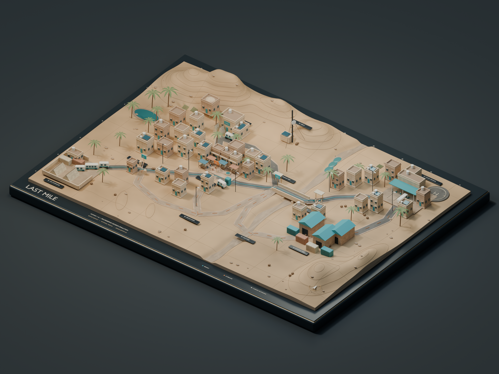
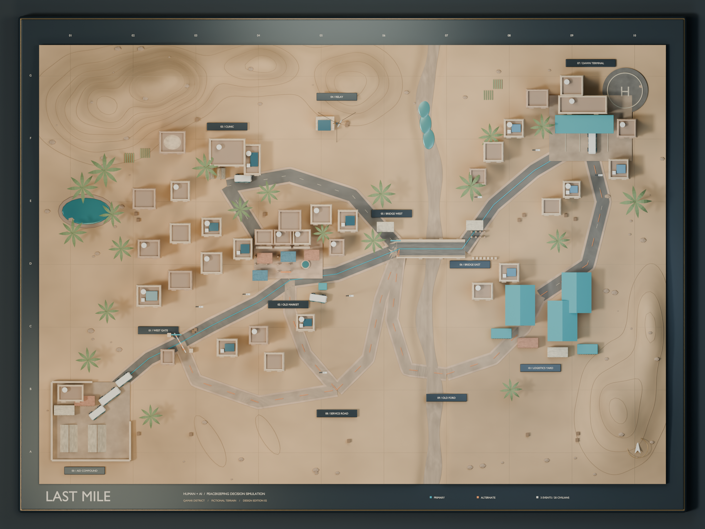
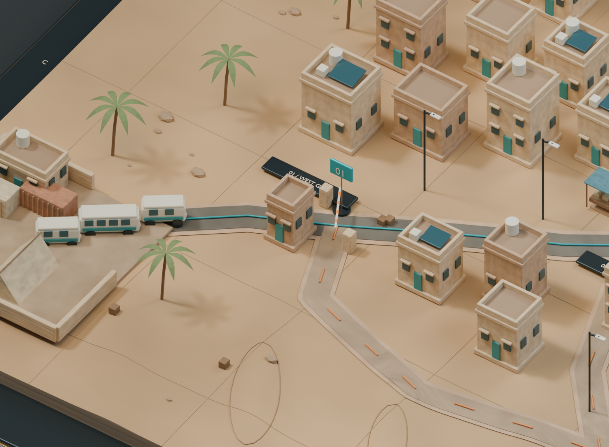
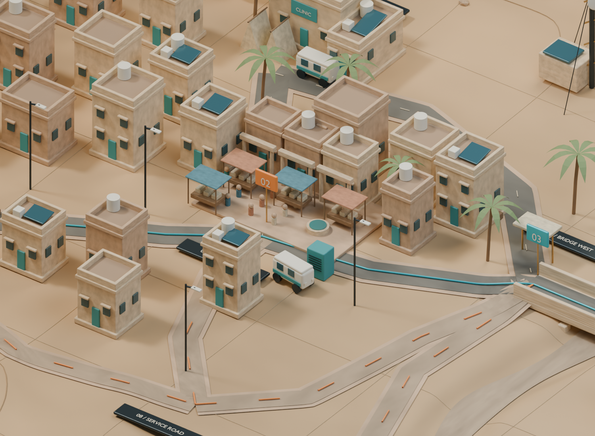
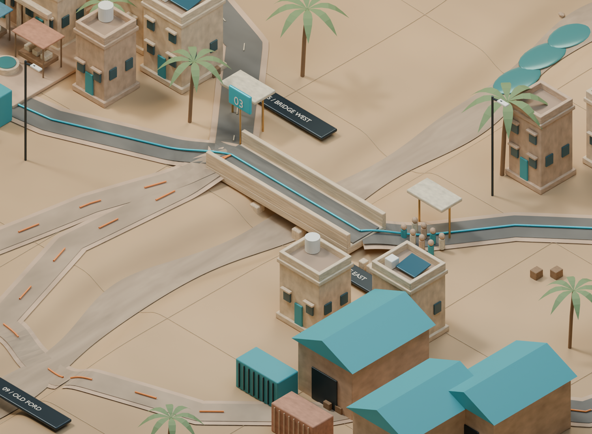

# LAST MILE
## 地图设计与资产接入

**概念地图 v2 · 虚构纳玛尔地区 / 卡马尔城外围 · 2026.09**



| 地图范围 | 交互结构 | 一局目标 |
| --- | --- | --- |
| 城镇、河谷、山脊与物流区 | 11 个节点 / 13 条路线 / 3 幕事件 | 护送 20 人，600 秒内完成转运 |

这是一张围绕**平民保护、证据核验与人机协作**设计的微缩沙盘。玩家在地点与路线之间做决定；模型负责提供空间感、情境与可点击位置，游戏逻辑负责判定信息、计时和结果。

**交付性质：赛前概念资产与接入说明。** 当前已制作模型与配套设计；可玩游戏、引擎集成、联网和性能验收尚未实现。本手册面向美术、关卡设计与程序协作，配合《LAST_MILE_故事与游戏设计》使用。

<!--page-->
## 01 / 先读懂这张地图



### 从西南出发，在东北完成交接

**主线顺序：** N00 安全集结院 → N01 西门检查站 → N02 旧市集 → N05 主桥西端 → N06 主桥东端 → N07 曙光撤离站。

**空间节奏：** 开阔集结院让玩家理解任务；狭窄检查站让队伍停下来核验；热闹市集产生信息冲突；横跨河谷的桥让最后一次路线选择清晰可见；撤离站给出明确的抵达反馈。

**三层阅读：** 先识别地标轮廓，再看道路走向，最后打开证据卡。青绿屋顶与车辆帮助找到公共服务设施；砂岩和土路保持区域连贯性。人群不等于威胁，建筑外观也不替代证据。

### 演示标注与正式游戏界面

预览中的名称牌、蓝色主路线、橙色替代线、调查格网和幕号属于**设计叠加层**。它们帮助团队讨论，不是已经完成的游戏 UI。正式游戏宜只显示当前可选路线、目的地、预计耗时与事件锁定原因；不把所有答案提前铺在地图上。

北为 Blender 的 +Y。地图使用艺术场景单位，**不是米、真实地理数据或军事通行分析**。地形高低与道路长度用于视觉叙事；每段行动时间以 JSON 中的 authored seconds 为准。

<!--page-->
## 02 / 11 个节点：每个地点都有用途

节点编号是协作契约：文案、模型、JSON 和事件触发都引用相同的 N00–N10，不以显示名称作为程序主键。地区中的建筑是背景资产，节点才是 MVP 可点击的交互位置。

| ID | 地区 | 美术识别 | 交互用途 |
| --- | --- | --- | --- |
| N00 | 安全集结院 | 围合院落、救援帐篷、物资托盘；三车车队以浅色涂装形成视线起点。 | 简报、角色分配与出发；护送 20 人，按设定分乘 16 人巴士与 4 人医疗车。 |
| N01 | 西门检查站 | 砂岩岗亭、路障柱、可转动横杆；道路变窄，形成第一个明确停顿。 | 第一幕 E1。查看许可、检查来源和时效；放行动画由事件状态驱动。 |
| N02 | 旧市集 | 棚布摊位、柱廊、喷泉、屋顶水箱与电力柜；可辨认的日常生活场所。 | 第二幕 E2。对比传言与原始记录，检查“多份报告是否来自同一来源”。 |
| N03 | 社区诊所 | 社区诊所、分诊遮棚、停车医疗车；柔和青绿色与主建筑对应。 | 可选扩展。补充交接支持，任务钟继续；不在 MVP 主线必经路径。 |
| N04 | 山脊通信站 | 山脊天线、拉线、微波碟与太阳能板；北侧高处地标。 | 远程证据热点。查通信记录，不可驾驶抵达；不增加可行驶路线。 |
| N05 | 主桥西端 | 桥西候车棚、护栏及桥头开阔区；镜头能观察人群与桥面关系。 | 第三幕 E3 的决策点。核验人群身份及通行条件；选择协调过桥或绕行。 |
| N06 | 主桥东端 | 桥东分隔墩、登记队列、另一端候车棚；与西岸共同表达民用桥梁。 | 主桥通过后的中继节点；队列是场景表现，具体证据由状态机提供。 |
| N07 | 曙光撤离站 | 青绿装卸雨棚、接驳巴士、装载车位与停机坪；视线终点。 | 终点与交接。以到达状态触发结算；停机坪仅作环境，不预设飞行玩法。 |
| N08 | 南侧服务路 | 南部裸土服务路、稀疏路灯与低矮建筑；色彩较暗、路径更迂回。 | 早期绕行支路中继。E1 分支先返回 N02，E2 后才能接入南侧外绕。 |
| N09 | 旧河床便道 | 旧河床浅滩、砂石坡岸、粗糙便道；强化绕行的时间代价。 | 第三幕桥梁替代线的中继；属于游戏路线，不用于推算真实越野能力。 |
| N10 | 仓储转运区 | 坡屋顶仓库、集装箱、货箱和转运空地；工业尺度与市集形成差异。 | 旧河床绕行后的中继，沿仓储外围进入撤离站。 |

### 让地图丰富，让第一版流程可控

MVP 保留 3 幕必经决策与两组绕行分支。N03 诊所先作为环境地标，完成主线后再启用停靠；N04 通信站仅允许远程调查。没有通向 N04 的路线是设计选择，不是漏建道路。

**模型内人形是氛围占位资产。** 市集居民、桥上队列和终点人员不计入车上的 20 人，不应通过数模型人数推导任务真相。

<!--page-->
## 03 / 13 条路线：时间就是选择的成本

路线默认双向；事件状态可限制当下可用方向与目的地。下表是移动所需的任务时钟秒数，不包括协商、调查等待或停靠支持。以 `last_mile_map.json` 中的 `seconds` 为唯一移动计时来源。

| 路线 | 连接 | 移动时间 | 关卡用途 |
| --- | --- | --- | --- |
| R00 | N00 → N01 | 30 秒 | 固定出发段 |
| R01 | N01 → N02 | 45 秒 | E1 核验后的主路 |
| R02 | N01 → N08 | 75 秒 | E1 南侧绕行前半段 |
| R03 | N08 → N02 | 50 秒 | E1 返回市集；E2 反向绕行 |
| R04 | N02 → N05 | 50 秒 | E2 市集至桥西主路 |
| R05 | N08 → N05 | 95 秒 | E2 南侧外绕接回桥西 |
| R06 | N05 → N06 | 35 秒 | E3 协调后的主桥段 |
| R07 | N06 → N07 | 50 秒 | 主桥至终点 |
| R08 | N05 → N09 | 70 秒 | E3 旧河床绕行第一段 |
| R09 | N09 → N10 | 70 秒 | 旧河床至仓储区 |
| R10 | N10 → N07 | 60 秒 | 仓储区至终点 |
| R11 | N02 → N03 | 40 秒 | 诊所扩展去程 |
| R12 | N03 → N05 | 65 秒 | 诊所扩展回主线 |

### 四组对比，足够支撑第一版决策

| 比较 | 纯移动时间 | 设计作用 |
| --- | --- | --- |
| 主线 N00 → N01 → N02 → N05 → N06 → N07 | 210 秒 | 为核验、讨论和协商留出时间 |
| E1：N01 → N02；或 N01 → N08 → N02 | 45 / 125 秒 | 绕行多 80 秒；不能跳过市集事件 |
| E2：N02 → N05；或 N02 → N08 → N05 | 50 / 145 秒 | 南侧外绕多 95 秒；再次回到桥西决策点 |
| E3：N05 → N06 → N07；或经 N09、N10 | 85 / 200 秒 | 旧河床绕行多 115 秒 |

诊所扩展 N02 → N03 → N05 的移动为 105 秒；再加 30 秒交接支持，总计 135 秒。它不重置时钟，也不替代事件 E2 的信息选择。

**一只时钟。** 行驶、讨论与调查在实时任务钟上自然流逝一次，不能既让时钟自然前进、又额外减去同一段时间。简报、教程、结算暂停计时；第 480 秒是医疗交接软目标，第 600 秒是接驳窗口截止。

<!--page-->
## 04 / 三幕场景与可选扩展



**E1 · 未关上的门。** 在 N01 查看新鲜、一致且可追溯的信息。正确的 AI 建议是等待核验并走主路。程序根据状态转动横杆；玩家看到的是放行反馈，不能靠横杆初始姿态猜出答案。



**E2 · 一条消息，三个回声。** 市集事故被多次转述，三张报告卡看似独立。玩家核验导入记录后发现同源关系；AI 的初始聚合建议由场景规则明确编排，再根据上传证据纠正。烟雾状态仅在事件触发后呈现，不随公开 GLB 出货。



**E3 · 最后一班灯。** 桥上人群是登记转运队列。玩家需基于当前有效证据判断，而非因为上一幕出错就一概拒绝 AI。协调主桥通行与经旧河床绕行具有清晰不同的时间成本。

**可选层：** N03 诊所提供交接支持；N04 提供通信记录。两者用于主线稳定后的扩展，不增加本版本的第四幕主剧情。

<!--page-->
## 05 / 打开、查看和修改模型

### 先选对文件

| 文件 | 用途 | 怎样使用 |
| --- | --- | --- |
| LAST_MILE_Master.blend | 可编辑母版，保留相机、灯光、底座与展示层 | 在 Blender 选择 File → Open；用于调整建筑、材质、构图与出图 |
| LAST_MILE_GameMap.glb | 游戏场景资产，保留几何和命名热点 | 导入选定引擎或 glTF 查看器；需自行设置交互、光照和 UI |
| last_mile_map.json | 公开地图定义，无事件真相 | 读取节点、路线、耗时及两套坐标；作为点击与移动的数据源 |
| SERVER_ONLY_events.json | 作者/服务端事件配置，含私有真相与角色资料 | 仅存放服务端或主持人环境；不能放入客户端静态资源目录 |

### 在 Blender 里最快的查看顺序

打开母版后，先查看场景相机。数字键盘 0 切换相机视图；没有数字键盘时从 View → Cameras → Active Camera 进入。滚轮缩放、中键旋转视角；主键盘的 1 不等于数字键盘 1。右侧 Outliner 展开以下集合，按用途开关可见性。

| 集合前缀 | 内容 | 常见操作 |
| --- | --- | --- |
| 00_DISPLAY | 桌面底座、展示构件 | 汇报时保留；游戏导出排除 |
| 01_TERRAIN / 02_ROADS | 地形、河谷、道路、桥 | 改路后同步 JSON 控制点与耗时 |
| 03_CITY / 04_NATURE | 模块建筑、棕榈与岩石 | 保留道路净空和地标辨识度 |
| 05_PROPS / 06_ACTORS | 道具、车辆与人群占位 | 车队以父对象整体移动 |
| 07_LANDMARKS | 检查站、市集、诊所、通信站、撤离站 | 用于剧情镜头与互动反馈 |
| 08_DESIGN_OVERLAY | 名称牌、幕号、路线线与格网 | 预览讲解使用；正式游戏隐藏 |
| 09_HOTSPOTS | HOTSPOT_Nxx 与 PATH_Rxx 空物体 | 不渲染；供程序查找交互位置 |
| 10_EVENT_STATES / 11_STUDIO | 事件烟雾 / 相机灯光摄影棚 | 烟雾默认关闭；两层均不随 GLB 导出 |

修改前另存一份母版。建筑和车队优先选中父对象再移动，避免把门窗、车轮留在原位。点击节点的范围应在引擎中显示为轻量 UI 或拾取区域，不依靠可见路牌碰撞。

<!--page-->
## 06 / 程序接入：从“点击地点”开始

### 第一步：载入公开场景和地图数据

在所选引擎中载入 GLB 与 `last_mile_map.json`。GLB 不包含底座、演示标签/路线线、摄影棚、灯光相机和事件烟雾；包含地形、道路、城市、道具、角色及命名热点空物体。游戏应自行建立相机、环境光与界面。**当前未声称已通过任何具体引擎的运行验证。**

### 第二步：用节点 ID 绑定热点

遍历 JSON 的 `nodes`，以 `hotspot` 查找 GLB 节点名，例如 `HOTSPOT_N02_OLD_MARKET`；用 `id` 连接证据卡和事件。`drivable=false` 的 N04 只打开远程调查。`mvp` 标记用于首版筛选；是否开放还应由当前事件阶段判断。

每个节点提供 `position_blender` 与 `position_glb`；路线提供 `waypoints_blender` 与 `waypoints_glb`。**引擎使用哪一套坐标就全程保持一致，不再二次翻转。** 若导入器重新组织节点层级，按名称或 `node_id` 自定义属性查找；可退回 JSON 位置生成点击锚点。

### 第三步：处理坐标与移动

Blender 的地面为 XY、Z 向上；GLB 默认地面为 XZ、Y 向上。导出转换为 **(x, y, z) → (x, z, -y)**。例如旧市集的平面位置 (-4, -1)，若高度是 h，GLB 位置即 (-4, h, 1)。h 应读取 JSON，不用固定数值猜测。

地图先采用**点击节点打开行动面板**：玩家提交 `action_id` → 服务端校验当前阶段与所在节点 → 从事件定义取整段路线 → 按 `seconds` 与 `waypoints_glb` 播放移动 → 到达后触发下一状态。服务端不接受任意 `route_id` 的移动请求。沿途不做自由驾驶、轮胎碰撞或 NavMesh 寻路。路线反向行驶时同时反转路点顺序。

路点高度已经包含车队父对象所需的 0.126 单位垂直偏移。直接将原车队父对象放到路点，不要重复加此偏移；使用其他车辆时按车轮与根节点位置重新校正。

### 第四步：把路线图和事件状态机分开

公开图表示“地理上能连到哪里”；事件状态机决定“现在能选什么”。E1 绕行必须经 N08 返回 N02，不能沿 R05 越过 E2。在 N02 提交 E2_DETOUR 后，由服务端依次执行反向 R03 和 R05，到达 N05 才将 E2 标为完成。三幕按 E1 → E2 → E3 推进。

一个接入流程示意：

```
load(GLB, publicMap)
click(nodeId) -> validate(stage, nodeId)
commitAction(actionId) -> serverValidate -> executeSequence
arrive(nodeId) -> updateStage() -> showAllowedActions()
```

### 第五步：只把玩家上传的证据交给 AI

世界真相、角色私有证据、共享看板、AI 已上传资料分别保存。AI 输入按证据 ID 白名单组装，不将整个 `SERVER_ONLY_events.json` 注入提示词。浏览器静态页面中嵌入的 JSON 对玩家可见；单机原型若内置真相，应明确只作演示，不能承诺保密。

<!--page-->
## 07 / 从概念资产到参赛原型

### 视觉、功能与性能分别验收

**视觉：** Blender/Cycles 预览包含完整的摄影棚与程序化材质。GLB 的标准材质不能直接复制全部噪声节点、程序纹理和渲染器光照。若需要接近预览，先烘焙基础色、法线和粗糙度贴图，或在引擎中重建材质；不要把预览画质当作导入后的保证。

**功能：** 模型没有成品 UI、证据权限系统、联网、存档、语音或可玩任务循环。热点与路线 JSON 为接入提供位置和数据。先在单屏角色切换或 2–3 人口头协作模式跑完三幕，再增加远程多人功能。

**性能目标，尚未验收：** 以目标设备实测为准，可先争取 1080p 下稳定 30 FPS、首屏加载 10 秒内、主要贴图最长边 2K。导入后先统计三角面、材质数量、绘制调用、内存和 GLB 体积，再决定简化地形、合并静态件、实例化重复建筑/棕榈和生成 LOD。当前资产没有承诺达到这些预算。

### 建议接入顺序

| 顺序 | 工作 | 可检查的完成条件 |
| --- | --- | --- |
| 1 | 固定俯视/斜视相机，载入地形与热点 | N00–N10 名称可定位；N04 不可驾驶 |
| 2 | 实现节点点击与路线移动 | 主线顺序完整；13 条路线端点一致 |
| 3 | 接入 E1 / E2 / E3 状态机 | 替代路径仍经历三幕；每个决策都可回放 |
| 4 | 证据卡、来源图、AI 上传白名单 | 角色秘密不直接共享；AI 只读上传项 |
| 5 | 单一任务钟、到站交接与结算 | 调查/移动不双扣；600 秒截止一致 |
| 6 | 试玩、性能与发布资源审查 | 用记录区分设计目标、实测结果与待修问题 |

### 交付与发布检查

- 母版保留可编辑层级；导出资产单独命名，不覆盖旧版沙盘备份。
- 公开地图 JSON 标记 `scenario_truth_included=false`；不放角色私密文字或“真实原因”字段。
- `SERVER_ONLY_events.json` 和完整故事剧透仅供团队/服务端；公开仓库、网页与参赛演示包按用途分发。
- 模型最终使用 Blender 内置 Bfont 展示字形；GLB 排除文字标签。游戏 UI 字体与新增第三方素材仍需在发布前核对许可。
- 使用虚构地名和民用设施；不把道路时间、AI 判断或伤情状态宣称为现实行动建议。
- 在比赛允许的制作周期、素材复用及 AI 使用披露规则确认后，决定如何使用这份赛前概念资产。

**下一步的最小里程碑：** 选定引擎后，把三个事件与一条主线做成可从开始到结算的灰盒版本，再把本沙盘接入。故事、时间数值与证据规则以同包设计文档和事件配置为准。
