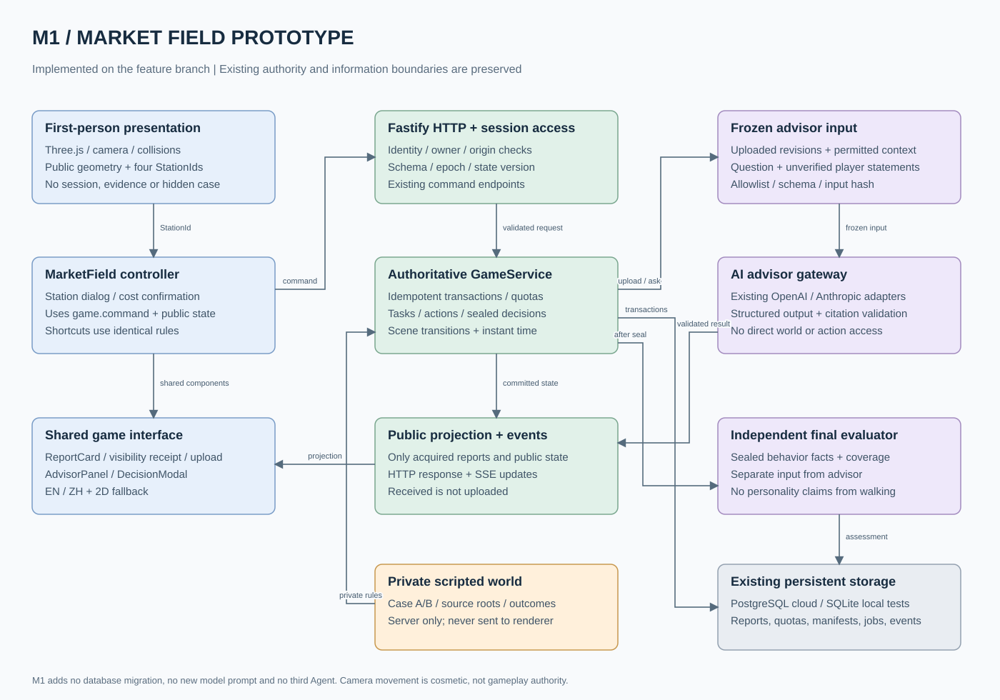
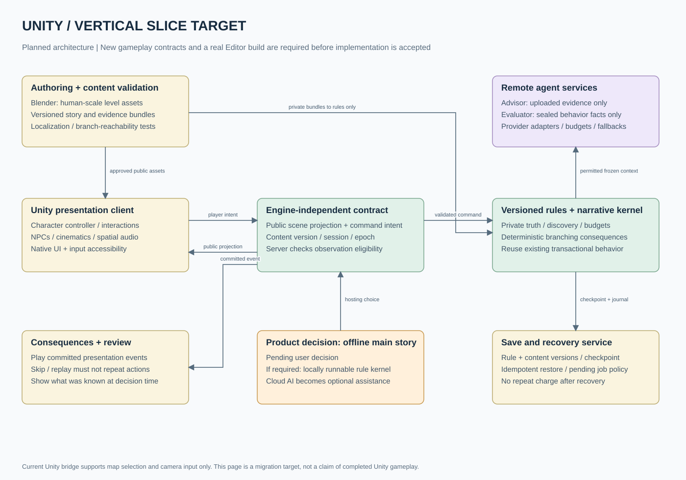

# HLD / 场景化游戏的增量架构

## 1. 当前实现：M1 三关增量

[编辑 draw.io 文件](diagrams/market-slice.drawio)。第一页为最初市集切片，三关共用同一业务结构；第二页为迁移目标，不能当作当前已实现组件。

在现有 React 游戏壳中使用共享的 `MarketField`（为兼容保留最初组件名）。`fieldLayout(sceneId)` 选择西门、市集或主桥的中性布局。`MarketViewport` 专门负责公共停靠区、摄像机与碰撞，不接收 session、case、报告或 AI 回复。它唯一的交互输出是四个受控站点 ID。业务容器把站点交互映射到既有任务、上传与提问接口。

核心规则、预算和分支后果仍由 `GameService` 执行；Three.js 帧循环不推进剧情，不结算调查，不解析剧本。视觉错误最多影响操作体验，不能成为扣费或判定依据。

### 三种信息空间

1. **世界真相**：服务端 `World` 加载私有剧情；决定可获取报告与行动后果。
2. **玩家已知**：服务端公开投影与报告；前端记录实际展开可见的报告回执。3D 可见模型不是证据，M1 只做中性停靠区。
3. **AI 已知**：已上传的不可变证据、获准背景、玩家陈述和问题组成冻结清单。玩家收到但未上传的报告不在此空间。评估 Agent 使用独立行为事实输入，不复用顾问上下文。

## 2. 当前请求时序

**简报**：附近站点交互或地点快捷按钮 → 岗位对话框 → 玩家选择主题 → `POST /tasks` → 身份、epoch、stateVersion、场景与额度校验 → 事务写报告/事件/额度 → 返回任务结果并更新公开投影 → 展开 `ReportCard` → 可见回执。

**调查**：侦察台 → 从 `taskOptions` 选择 → `InvestigationModal` 展示成本/能力边界 → 确认后发送任务 → 即时结算剧情耗时 → 显示报告。关闭确认窗口不产生任务。

**AI**：玩家点击报告上传 → 创建上传快照与输入清单 → 顾问作业异步执行 → Schema/引用校验 → 结果投影/SSE → AI 侧栏。玩家追问生成新冻结上下文。场景渲染层只请求同源静态资产，不调用业务或模型接口。

**行动**：玩家选择公开 action → 原路线确认 → 服务端决定分支 → 前端转到新 scene，保留现场模式并按新 scene 重建场景。主桥拒绝仍在 E3，公开回执提示继续调查或改道。抵达 N07 后，`Debrief → ArrivalScene → ArrivalViewport` 呈现静态尾声，独立评估按原管线继续执行。M2 的动画演出应消费已提交的公开事件，绝不通过动画回调重新执行 action。

## 3. 存储、服务与部署

M1 不新增服务、数据库、依赖或环境变量。现有 Fastify 继续提供静态前端、HTTP/SSE、模型及可选语音代理；云端数据库仍是 PostgreSQL，开发与隔离测试可用 SQLite。新模块跟随 Vite 构建并按需加载。

新增数据仅为浏览器内的摄像机位置、按键集合、打开的站点、展开的报告和完成行动的展示回执。它们不是服务器存档，不影响任务规则。返回地图重新进入现场会重置视角；游戏报告/预算仍取原 session。三个场景 GLB 按需加载；终局场景仅在资源就绪或尺寸变化时绘制。

真实云端 PostgreSQL、Unity Editor、OpenAI/Anthropic 和 Deepgram 不属于本次离线回归测试覆盖范围。已有部署方式不自动等于商业发行架构。

## 4. Unity 迁移目标

正式关卡需要人尺度场景、碰撞体、角色/车辆动画、音频、镜头和原生 UI。当前沙盘 FBX 可以继续承担战略视图；不能把它直接放大就称作第一人称关卡。

迁移顺序：

1. 冻结引擎无关的 `StationId → command intent` 映射和公开投影。以浏览器原型作为行为验收参照。
2. 在 Unity 完成移动、镜头、交互和 1 米尺度灰盒；原 WebGL bridge 目前仅支持地图选择/相机消息，必须设计并校验新版本交互事件，不能假装已经支持。
3. 为“现场物件观察”新增服务端解锁/报告规则后，Unity 仅展示获准观察；渲染包不含未解锁描述、来源根 ID 或分支表。
4. 原生版本补齐输入、UI、网络重连、构建与保存恢复。先完成一个可运行、可安装的 Unity 切片，再批量替换美术和扩章节。
5. 根据离线产品决定，把规则内核做成可本地运行或继续服务端权威。离线包无法对设备拥有者保守全部剧本秘密；这里要区分正常游玩防剧透与防逆向，不作不可能的保密承诺。

## 5. 关键设计决定

| 决定 | 原因 | 代价 / 退出条件 |
| --- | --- | --- |
| M1 复用浏览器 Three.js | 本机无 Unity；现有能力可真实试玩与测试 | 这是交互验证资产，不等于已完成原生迁移 |
| 保留核心服务 | 已有原子扣额、幂等、AI 隔离及自动测试 | 后续逐步拆解大 core 文件，不能边重写边改变规则 |
| 使用公开站点而非直接新证据 | 不绕过现有报告/上传预算 | M2 必须补上权威观察模型，才有深入的现场调查 |
| 无移动遥测/存档 | 摄像机不影响 M1 规则；避免无用写库 | 不用移动行为评价玩家信任；M4 单独设计存档 |
| 单一业务调用链 | 3D/2D/快捷入口共享动作规则 | UI 需要处理同一份 stateVersion 的变化 |
| 无自由生成剧情 | 让后果、证据和评估可测试 | 自由 NPC 表述未来也只能使用当前可见事实 |

## 6. 商业规模前必须解除的限制

`World` 和公共类型现在写死两套案例、三关；不能直接复制 JSON 当作无限章节系统。需要版本化 ContentBundle、作者校验、分支可达性、证据独立性验证和 localization 完整度校验。

当前恢复策略可能把未结束会话封为技术中断，尚不是商业游戏自动存档。存档必须包含 rule/content version、状态、已交付报告、上传快照、已完成动作、进行中作业及迁移策略；恢复不能重扣资源或重发付费模型请求。

后续付费权益、持续模型成本、供应商故障、离线体验和发行平台要一起设计。M1 不新增订阅、购买资源或依赖某个模型永久可用的承诺。
