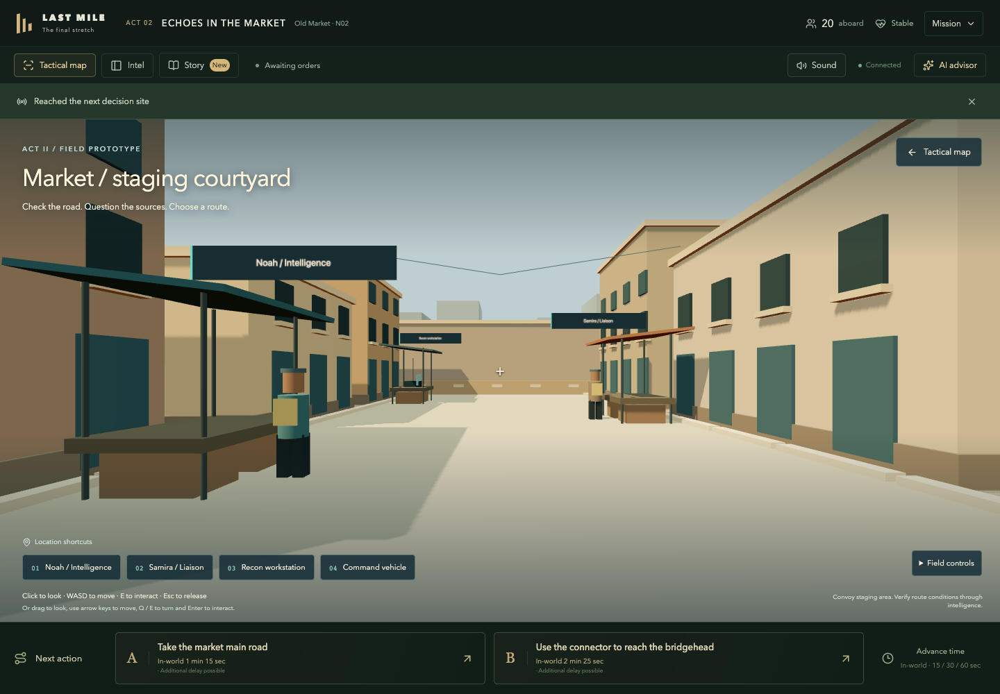
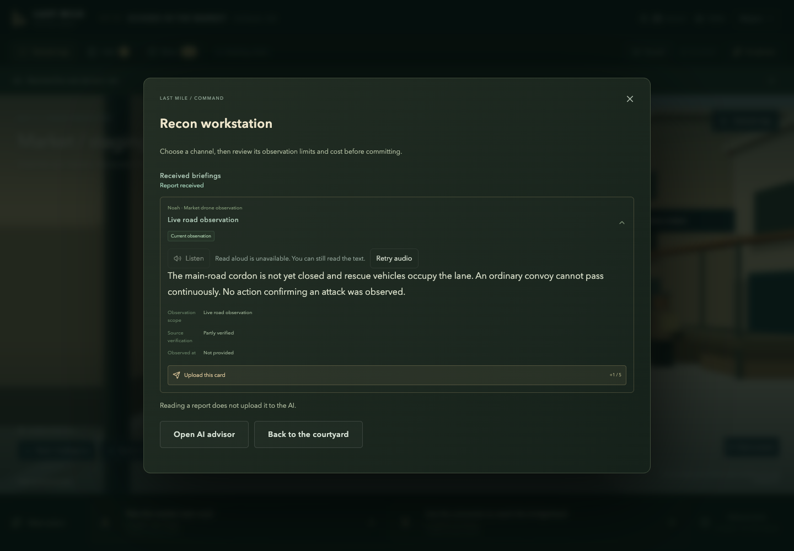
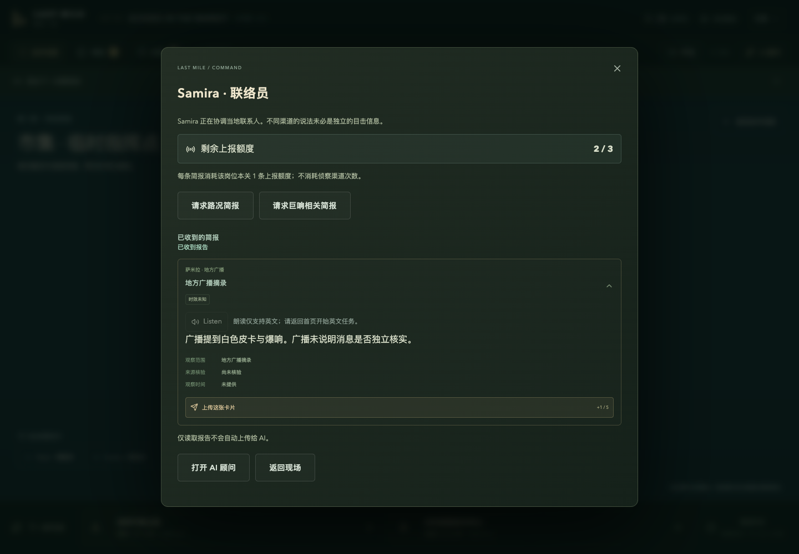

# M1 验收与试玩

日期：2026-09-21；基线提交 `70d5864`；开发分支 `feature/market-first-person-slice`。本记录覆盖本次新增市集现场，不能作为 Unity 成品或商业发行验收。

## 2026-09-22 美术样板增量

新增真实 Blender/GLB 资产、内嵌 PBR 贴图、资源释放、模型/贴图失败回退、角色与道具碰撞，以及 CSP 的 blob 图像解码支持。详见 [实现记录](art-direction/implementation-v1.md)。

最终验证：`pnpm build` 通过；`pnpm test` **445 通过、21 跳过**；市集/完整流程浏览器测试 **6 通过**。PostgreSQL 和 Unity 原生测试仍未执行。以下保留原 M1 交付记录供比较。

## 原 M1 实际执行的检查

| 检查 | 结果 | 覆盖与限制 |
| --- | --- | --- |
| `pnpm build` | 通过 | TypeScript + Vite 生产构建 |
| `pnpm test` | **443 通过，21 跳过** | 34 测试文件通过，2 文件跳过；没有提供云端 PostgreSQL 测试库 |
| `pnpm exec playwright test tests/ui/instant-actions.spec.ts` | **4 通过** | Chrome、真实 HTTP 服务与构建后的前端；隔离 SQLite、offline Agent |
| `node scripts/build-unity.mjs --check` | 未找到 Editor | 本机没有验证任何新的 Unity C# 或 Unity 构建 |
| 本地 `preview-market.ts` | 已启动并检查 | 临时内存会话、绑定 127.0.0.1:3112，不使用用户 `.env` |
| draw.io 预览 | 已检查 | 原生可编辑 XML；对应 SVG/PNG；PNG 用 Chrome 渲染核对 |

### 新增验证的关键行为

1. 键盘实际控制相机走到 Noah 附近，面向站点时 Enter 打开交互。
2. 走动、打开站点、打开调查确认不扣资源；请求简报扣本岗位一次上报；确认无人机调查扣一次无人机额度。
3. 报告打开后保留原证据内容、范围与手动上传按钮；没有自动上传。
4. 从 Agent gateway 捕获实际输入：只含主动上传的侦察报告，不含已收到但未上传的岗位简报；追问沿用同样边界。
5. 选择下一条路线后进入 E3，市集视图卸载。
6. 中文模式人为禁用 WebGL 后，备用地点交互仍能获取报告并回到地图。
7. 既有全三关流程和调查失败重试测试仍通过。
8. 纯逻辑测试覆盖斜向速度、帧间隔上限、碰撞滑动、边界和隔墙/背向交互限制。

## 如何试玩

仓库目录：`/Users/xingchenliu/Desktop/repos/last_mile`。

```bash
pnpm preview:market
```

该命令先构建，再创建可直接进入第二章的**临时本机预览**；终端打印带 session 参数的 URL。打开后点 **Enter market on foot**。预览的 AI 明确使用 offline 模板，用来检查玩法与界面，不会消耗真实模型额度；停止进程后临时数据消失。

如果要测试现有真实模型配置，仍使用项目原来的 `pnpm dev` / `pnpm start` 和服务端 `.env`，从第一关正常进入 E2。不要将这个本地 preview 命令设为 Render 的 Start Command。

操作：点击画面锁鼠标，WASD 移动，E 交互，Esc 释放。未锁鼠标时可拖动转向、方向键移动、Q/E 转向、Enter 交互。也可以使用左下角地点按钮完成全部流程。

## 界面截图







## 尚未验收 / 下一阶段

- 本轮未调用付费 OpenAI、Anthropic 或 Deepgram；未新增/修改供应商适配。
- 未连接线上数据库做迁移或压力测试；本次没有数据库变更。
- 未编译 Unity、未验收原生安装包、手柄或不同显卡性能。
- 角色为静态占位模型；场景没有新增可改变真相的物件观察、NPC 自由对话或车辆结果演出。
- 当前“完整流程”是现有简报/调查/上传/提问/行动从 3D 入口可用，不代表 GDD 中 20–30 分钟 M2 内容已经完成。
- 商业版离线策略仍待产品确认。M2 观察契约、真实存档、内容工具和商业发行工作未完成。

代码在 feature 分支单独交付；是否已经推送以实际 Git 状态为准，不据本文件推定已部署。Render 线上 main 版本需要合并发布后才会包含此功能。
