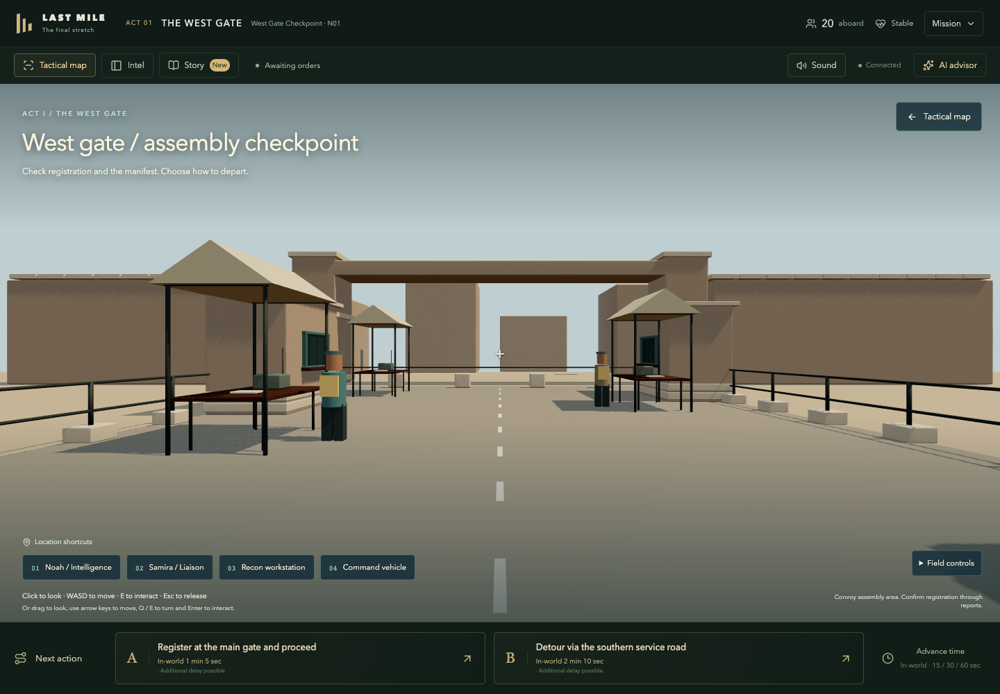
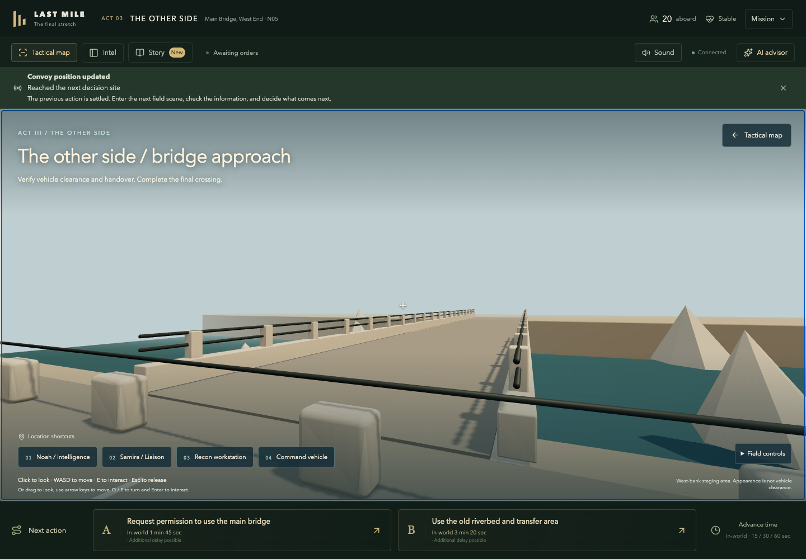
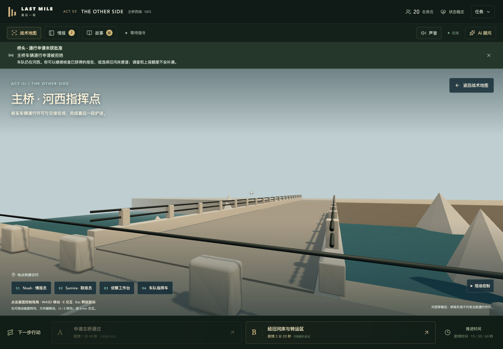
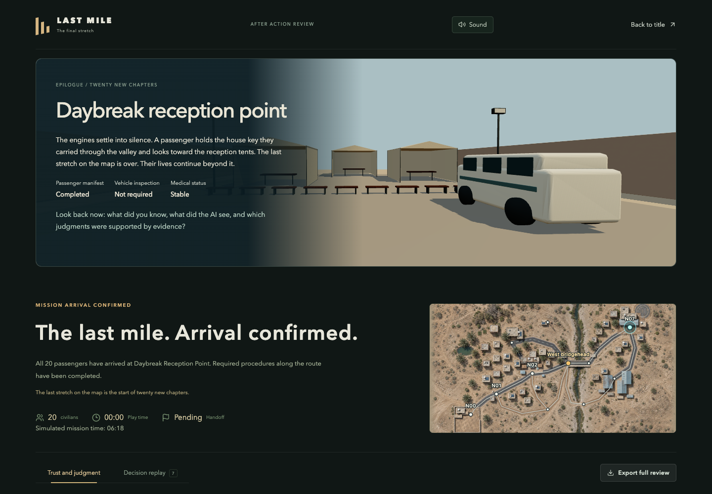

# 三关现场与黎明接收站：实现记录

日期：2026-09-22。分支：`feature/market-first-person-slice`。

本次将既有三关的调查、AI 与行动流程接入各自的 3D 现场，并补上接收站尾声。剧情结果仍使用已实现、经过测试的 A/B 剧本；没有增加第四关或改变调查预算。当前完成的是可连续试玩的关卡原型，角色演出和商业级环境美术还需继续制作。

## 1. 可玩的完整故事线

20 名平民登上车队，玩家负责穿过虚构山谷，抵达 Daybreak 接收站。Noah 提供情报分析与影像方面的报告；Samira 提供地方机构和人员联络方面的报告。玩家可以自行决策，也可以选取资料上传给 AI，核查建议后再行动。沿途没有全知的角色替玩家宣布正确答案。

### 第一关：西门 / THE WEST GATE

**戏剧问题**：车队已经集结，登记、乘员名单和通行安排是否齐备？

1. 从西门集结区进入：检查站、登记棚、无线电工作台、指挥车构成可步行空间。
2. 向 Noah 请求道路或西门状态简报；向 Samira 请求名单或西门状态简报。站点开场文字只介绍职责，事实来自实际获取的报告。
3. 可从侦察台选择服务端公布的进一步调查；确认前展示成本。阅读与走动不会消耗模拟时间。
4. 对照报告或手动上传资料询问 AI；无需咨询 AI 也能行动。
5. 选择主门登记或南侧绕行。主门路线处理名单，绕行保留待办并进入市集。资源余额沿用到下一关。

### 第二关：市集回声 / THE ECHO

**戏剧问题**：零碎的巨响消息与道路说法，是否真是独立证据？

1. 车队停在市集外的临时指挥点；已有 Blender 店面、棚架与情报摊位继续使用。
2. 两个岗位均可提供道路与消息来源主题；在当前报告和渠道选项里寻找值得核验的问题。
3. 溯源必须选择具体报告，产生新的报告与额度消耗；收取和阅读不会自动上传给 AI。
4. 选择主路或连接路。不同剧本的查验后果由规则结算，随后进入主桥。
5. 进入新关时，岗位和上传额度按既有规则进入新的每关账户；卫星、无人机、机构和目击者余额保持整局共享。

### 第三关：主桥 / THE OTHER SIDE

**戏剧问题**：桥面看起来完整，是否意味着车队获准通行？

1. 玩家进入河西指挥区，可走到步行边界观察桥梁、河道和接近道路。两套剧本使用完全相同的环境，不用画面预告权限结果。
2. Noah 提供道路、主桥状态主题；Samira 提供名单、旧河床便道主题。
3. 指挥车增加交接准备面板：显示名单、查验和医疗的公开状态。打开面板不补办手续、不刷新资源。
4. 通过调查、已有报告和可选 AI 咨询，判断申请主桥还是选择旧河床转运。
5. 如果主桥申请被拒，行动结算后显示明确回执：车队仍在河西，允许继续调查、查看报告并改道；重复桥梁申请不可用。拒绝不重置任何本关或全局额度。
6. 路线抵达 N07 后退出交互场景，进入封存结局。

### 尾声：黎明接收站 / DAYBREAK

接待棚、座椅和车队构成静态三维尾声。乘员一直带着的家门钥匙作为叙事呼应，连接旅途结束与未来生活；不据此新增规则事实。

结局先显示实际名单、查验与医疗状态，再引导玩家反思“当时知道什么、AI 看到了什么、判断由什么支持”。若仍有待办或终止原因为 `awaiting_transfer`，明确显示抵达后仍待交接。既有独立评估、时间线和导出继续可用。

`taskSuccess` 表示抵达任务目标的结果字段，不能单独用来宣布交接已完成。当前引擎没有写入新的 `handoffCompletedAtMissionMs`；本次界面不伪造交接完成时间。

## 2. 作者验收用的分支表

此表仅用于仓库内开发/验收，不能导入客户端内容包。

| 路线 | A 剧本 | B 剧本 | 下一节点 |
| --- | --- | --- | --- |
| E1_MAIN | 处理名单登记 | 处理名单登记 | E2 / N02 |
| E1_BYPASS | 名单仍待办 | 名单仍待办 | E2 / N02 |
| E2_MAIN | 增加查验待办 | 无新增查验待办 | E3 / N05 |
| E2_BYPASS | 无新增查验待办 | 无新增查验待办 | E3 / N05 |
| E3_BRIDGE | 抵达；不自动清除已有待办 | 申请被拒，保留本关与额度，可选便道 | A: N07；B: N05 |
| E3_FORD | 转运步骤处理待办后抵达 | 转运步骤处理待办后抵达 | N07 |

服务端原 `tests/core/core.test.ts` 覆盖两案例下的 16 种路线组合，包含拒绝后改道。前端新增测试重点验证入口、跨关状态、回执和终局呈现，不另写一套决定后果的客户端引擎。

## 3. 代码与资源

| 组成 | 文件 / 作用 |
| --- | --- |
| 公共布局 | `client/src/lib/campaignField.ts`：章节布局、岗位主题、双语文案 |
| 移动碰撞 | `marketField.ts`：接受 `FieldLayout` 的共享移动与视线检测 |
| 三关现场 | `MarketField.tsx` + `MarketViewport.tsx`：复用全部业务交互，按章节加载环境 |
| 连续流程 | `GameView.tsx`：换关保留现场模式、重置局部状态；已确认的行动回执 |
| 结局 | `chapterPresentation.ts`、`ArrivalScene.tsx`、`ArrivalViewport.tsx` |
| 建模脚本 | `scripts/art/create-campaign-fields.py` |
| 编辑源 | `assets/authoring/campaign-fields-v1/*.blend` |
| 浏览器资产 | `client/public/assets/fields/*-v1.glb` |

新增模型实测导出量：

| 场景 | 网格 | 三角形 | 文件字节数 |
| --- | ---: | ---: | ---: |
| 西门 | 13 | 21,420 | 4,253,784 |
| 主桥 | 14 | 23,436 | 4,494,284 |
| 接收站 | 10 | 6,936 | 2,248,680 |

GLB 内嵌贴图，无外部纹理 URI；按材质合并网格。当前场景按需加载，离开时释放 WebGL、模型及图片资源；接收站只在内容/尺寸变化时绘制。模型面数与体积是资源记录，不能代替硬件帧率测量。

## 4. 本地试玩

在 `/Users/xingchenliu/Desktop/repos/last_mile`：

```bash
pnpm preview:campaign
```

构建后在 `127.0.0.1:3113` 创建临时内存会话，终端打印带 session 参数的完整链接，直接从西门现场开始。默认 A 剧本、英文、offline AI。此入口不读取 `.env`，不连接生产库，不花费模型额度；停止预览后临时数据消失。

测试中文与拒绝分支时，停止当前预览并运行：

```bash
pnpm exec tsx scripts/preview-market.ts --campaign --case B --locale zh-CN
```

常规游戏的 `pnpm dev` / `pnpm start` 仍使用既有服务端配置，可接真实模型。不要将预览脚本用作 Render 启动命令。

操作：WASD/方向键移动；拖动视角或 Q/E 转向；靠近且面向岗位时 Enter 交互。点击画面锁鼠标后用鼠标转向、E 交互、Esc 释放。地点快捷按钮可直接打开同一岗位，不绕过任何预算。

## 5. 实机截图

以下来自构建后的浏览器游戏，不是概念图。









## 6. 验证与后续

实际命令与结果见 [验收记录](05_VERIFICATION.md)。单元测试覆盖三章站点可达性、角色主题与两套剧本一致、公开结果文案和资源包；浏览器测试覆盖中英文连续流程、真实调查扣额、跨关余额、主桥拒绝、改道、待交接和模型加载失败。

此增量没有 API、数据库迁移或 Agent 输入契约变更。已有真实模型适配继续适用，本轮验证使用 offline gateway。Unity 原生安装包、真实设备性能、角色绑定/动作、车辆演出和深层现场物件调查仍属于后续制作，不应把当前模型视作商业大作的完成质量。
