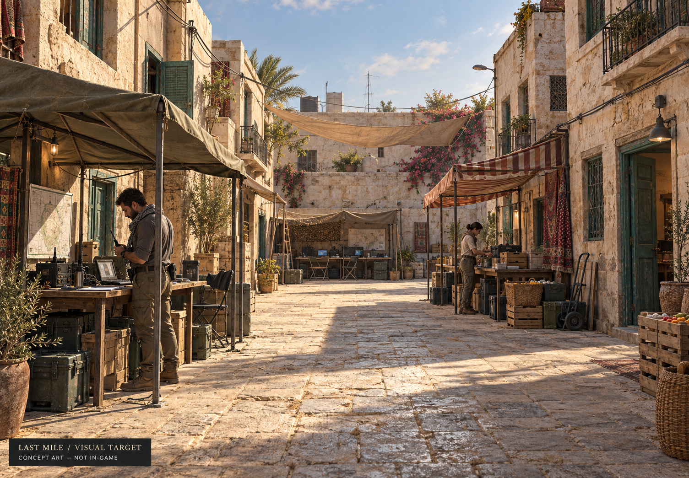

# 市集画面升级：电影感写实候选方案

2026-09-22。**状态：用户同意先精做样板区的开发方案，已确认两台 Apple Silicon 测试设备。** 以 macOS 原生版本验证写实方向；浏览器正式版是否为硬要求、最终画质档位和素材预算仍需定案。不改变已确认玩法，也不表示已实现这些 3D 资产。

此图由内置 imagegen 工具根据当前市集灰盒截图生成，用于表达美术目标。它不是 Blender 渲染、Unity 实机截图、可行走的 3D 模型或性能验证结果。完整提示词见 [PROMPT.md](PROMPT.md)。图中背景文件和地图仅是概念装饰，不可直接用作剧情证据。

## 实施进展

第一轮真实模型与游戏接入已开始交付，见 [实现记录与实际画面](implementation-v1.md)。这是局部资产样板，人物和其余街区仍为占位模型；Unity 原生验证等待磁盘空间与 Editor 环境。

## 1. 当前差距（实施前基线）

检查基线：`169af68`。

- 当前步行场景主要使用 BoxGeometry/CylinderGeometry，占位人物未绑定动画。
- 材质以单一颜色和固定 roughness 为主，没有成套表面纹理、法线和粗糙度细节。
- 遮阳棚、门窗、道具轮廓简单，近距离缺乏尺度参照与工艺细节。
- 光照已经有阴影、色调映射，但缺少与精细资产配合的完整灯光制作。
- 现有 Blender/FBX 是沙盘比例的环境，不能直接放大成近距离人物视角场景。
- 当前 Unity 项目使用 Built-in 管线，尚未配置 URP/HDRP；本轮不自动迁移引擎或材质。

## 2. 画面升级工作

| 层面 | 要制作的内容 | 验收方式 |
| --- | --- | --- |
| 建筑 | 模块化墙体、真正凹入的门窗、石材收边、倒角、阳台及屋檐 | 站在一米外观察；转角与侧面同样成立 |
| 材质 | 石灰墙、石材、木材、金属、帆布的颜色/法线/粗糙度纹理 | 中性灯光下仍能辨认不同材质；不靠贴图里烘死的阴影伪造体积 |
| 场景陈设 | 收音机、折叠桌、箱子、线缆、生活用品，布置有使用逻辑 | 不堵住主路径；同类资产尺度、风格统一；远近密度有节制 |
| 光照 | 明确时段、暖日照与冷天光、间接照明、接触阴影、轻微空气感 | 行走时稳定；角色和可交互物可辨；不靠过曝/景深掩盖缺陷 |
| 人物 | 正确比例、服装、绑定、待机/转身/交谈/操作设备动作 | 近距离观看及动作衔接，无明显穿插；视线与目标一致 |
| 演出 | 帆布轻动、人物忙碌、设备声、车队启停 | 重要线索同步有文字；环境变化不意外泄露隐藏剧情 |
| UI | 缩减常驻大标签，接近时显示交互提示，平板承载详细信息 | 可读性与键盘/替代操作不下降 |
| 性能 | 模型细节层级、贴图尺寸、灯光预算、遮挡与资源加载 | 在选定最低目标硬件上测量；概念图不是性能证据 |

## 3. 先做一个可验证的小场景

第一件成果为约 8 × 12 米的精细样板区：一个完整店面、一个有遮阳棚的情报摊位、一名可交互队员及相邻路面。沿用现有 Noah 简报与报告流程。

顺序：

1. 以写实概念为样板方向，按下方已确认设备制作 macOS 原生样板；用实际观感和性能决定最终配置。
2. 确定核心资产清单、制作方式与可用授权；普通建筑/道具可组合授权素材与定制建模，关键物件专门制作。没有预算批准前不购买资产。
3. Blender 中完成真实比例、轮廓、UV、法线和碰撞代理；导入选定引擎后建立材质与灯光基准。
4. 静态样板验收：三个玩家眼高机位、一个近景；之后在引擎里连续走一圈，避免只做一张好看的固定镜头。
5. 加入角色和交互，验证报告流程仍正确，画面信息不绕过调查规则。
6. 测量帧时间、显存/内存、加载时间，提供运行录像和构建。通过后才扩展整条街。

概念图是方向，不承诺逐像素复现。可信的验收物是可运行关卡、移动镜头录像和实测结果。

## 4. 平台选择

如果目标是高画质 PC 安装版，可以评估 Unity HDRP；如果浏览器直玩是正式版的硬要求，需要按支持 Web 的管线与资源预算设计。URP 同样可以制作高质量美术，不能把粗糙资产的问题归咎于管线。

Unity 6.3 官方比较表中，URP 支持 WebGL，HDRP 不支持 WebGL/WebGPU；所以必须先确定目标平台，再选择渲染路径。参考：[Unity 渲染管线功能比较](https://docs.unity3d.com/6000.3/Documentation/Manual/render-pipelines-feature-comparison.html)。

暂不迁移 Unreal、不购买新工具、不修改线上版本。Unity 安装在用户已批准的原生开发范围内，但需先解决当前磁盘空间不足。更换引擎只有在目标平台、画面与团队制作流程证明需要时才决定。

## 5. 已确认设备与初步性能目标

用户已确认：当前机器为 Mac mini M4 / 16 GB；另有 MacBook Pro M4 Pro / 24 GB。MacBook Pro 的屏幕尺寸、GPU 核数未确认，不假定具体变体。

| 设备 | 首轮用途 | 原生精细样板目标（尚未实测） |
| --- | --- | --- |
| Mac mini M4 / 16 GB | 基准测试、日常代码开发、确保较低配置可玩 | 1920 × 1080 实际渲染分辨率，标准画质，稳定 30 FPS |
| MacBook Pro M4 Pro / 24 GB | 更高画质验证、较重的 Blender/Unity 编辑工作 | 相同 1080p 下争取 60 FPS；再评估更高画质或分辨率 |

这是样板工程的目标设备集合，不是已经公布或验证的商业版最低配置。优先在 URP 中验证美术与性能；HDRP 保留为实测后评估的选项，不因为要写实就自动采用最高开销配置。画面重点是材质、模型、光照和构图，默认不以光线追踪为必要条件。

测试使用独立构建的 macOS 应用，记录芯片/GPU 型号、macOS 版本、Unity/管线版本、画质设置和实际渲染分辨率。MacBook 接电并记录电源模式；先在可重复的完整行走/交互路线预热，再连续测试至少 10 分钟。记录平均值、P95 帧时间、超过 50 ms 的卡顿、加载时间、进程内存和系统内存压力。30 FPS 档的预热后目标是 P95 不超过 33.3 ms，60 FPS 档为 16.7 ms；首次加载另行记录。未达标时先查瓶颈并优化，不用平均 FPS 隐藏持续卡顿。

两台机器使用统一内存，CPU/GPU 共享容量；开发时避免同时打开多个重型工程。渲染分辨率不默认等于外接 4K 显示器或 MacBook Retina 面板原生分辨率。模型服务仍在云端，不要求玩家本地运行 LLM。当前无需为这一样板区购买独立显卡或更换电脑；大规模内容生产的设备需求以后再评估。

规格参考：[Mac mini M4](https://support.apple.com/en-ie/121555)、[MacBook Pro M4 Pro](https://support.apple.com/en-ie/121553)。规格支持选择测试目标，不能代替本游戏实测。

## 6. 能力与范围

AI 辅助可以加速方案、建模脚本、资产整理、材质配置、引擎交互、测试与优化，但不能替代逐项视觉验收。精细角色、绑定与动画可能需要专用授权资产或美术制作。先追求商业品质的小场景，达到标准后再评估整款游戏的工作量、内容规模和预算。

后续决策：依据写实样板试玩确认最终美术标准；确认是否仍要求浏览器正式版；确定素材预算和最终最低配置。离线主线问题仍单独保留。设备确认不等于素材采购授权，也不等于整个商业版性能已经验收。
