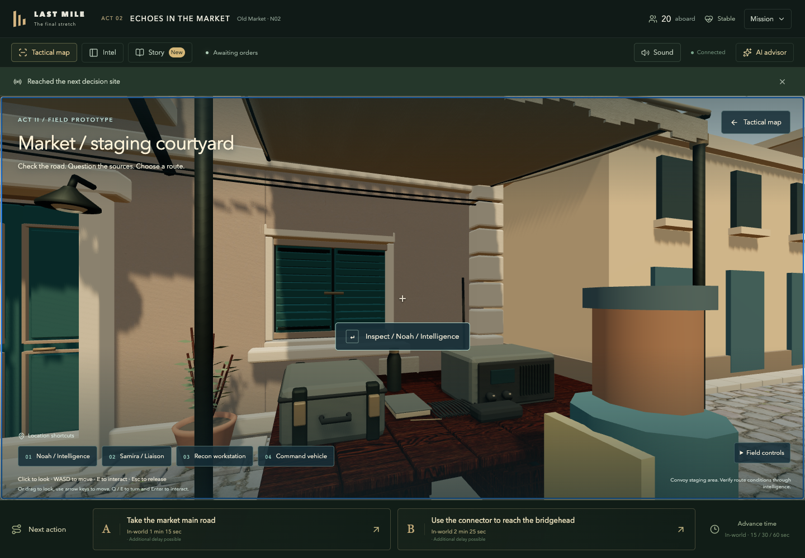
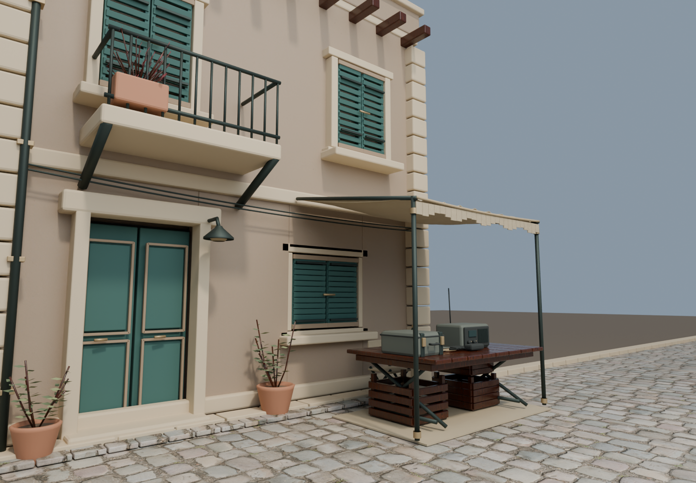
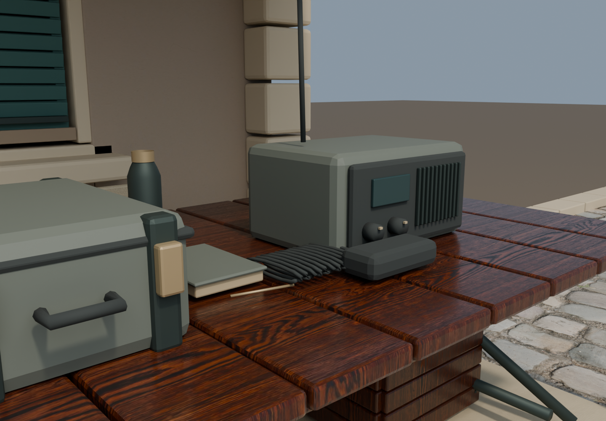

# 精细店面样板：第一轮实现记录

2026-09-22，开发分支 `feature/market-first-person-slice`。

## 已实现

- 制作了独立的 Blender 店面与情报摊位：门窗凹槽、百叶窗、石材收边、阳台铁栏、管线、下垂布棚、木板桌、折叠支架、无线电及卷线、运输箱、笔记本、水壶、木箱和盆栽。
- 使用真实比例、UV、PBR 贴图与倒角；模型不包含真相、路线状态或剧情证据文本。
- 在 E2 第一人称场景中异步载入 GLB，成功后替换对应占位店面、摊位与路面。其余街区、角色仍为占位模型。
- 下载失败/超时或任意内嵌贴图失败，保留原基础场景并显示双语提示。卸载场景会中止下载、释放 GPU 资源与 ImageBitmap；晚到的解码结果也会释放。
- 店面道具和角色增加碰撞边界。角色名称接近时显示，减少远处悬浮标签遮挡。
- 为内嵌图像解码允许 CSP `connect-src` 中的 `blob:`；外部网络来源依然未放开。静态阴影在首次绘制和模型载入后更新。

## 真实画面

### 游戏内 Three.js 画面

### Blender 离线材质/模型检查

两种图分别标注。Blender 的离线照明效果不能作为 Unity 实机效果或游戏帧率的证明；之前的 imagegen 概念图仍仅是目标参考。

## 资产与验证

源文件：`assets/authoring/market-sample-v1/`。素材来源、商业使用授权链接、原始文件哈希及复现命令见该目录 README 与 `texture-sources.json`。

| 项目 | 结果 |
| --- | --- |
| 编辑对象 → 导出网格 | 808 → 27 |
| 三角面 | 60,892 |
| GLB 下载体积 | 25,943,456 bytes，约 24.7 MiB |
| 贴图 | 1K / 2K，Poly Haven CC0，随 GLB 内嵌；游戏不调用素材站 |
| 生产构建 | TypeScript + Vite 通过 |
| 单元/HTTP 验证 | 445 通过，21 个 PostgreSQL 测试跳过 |
| 浏览器验证 | 6 项：完整交互/AI 信息边界、GLB 失败、内嵌贴图失败、中文无 WebGL、三章流程、调查失败重试 |
| 帧率 | 未做原生持续性能测试，不承诺已经达成 30/60 FPS |

`pnpm preview:market` 启动隔离的本地预览；点击 **Enter market on foot**，向左看即可看到新店面，沿摊位行走接近 Noah。预览使用 offline Agent；真实模型接入没有被替换或改写。线上 main 尚未合并这个功能分支。

## Unity 与下一步

本机可用磁盘约 10–11 GiB，Unity Editor 尚未安装。已提供 FBX、GLB、贴图与源工程，尚未进行 Unity 导入、URP 材质配置、C# 编译或 macOS 打包。

优先处理 Unity 安装空间，之后验证 URP 导入、相同眼高视角和 M4 原生性能。与此同时美术下一轮需要表面老化、角色比例/服装/绑定/动画、布棚与植物质感、间接照明和环境声音。这是第一轮可玩的资产接入，未达到已批准的商业级视觉验收门槛。
