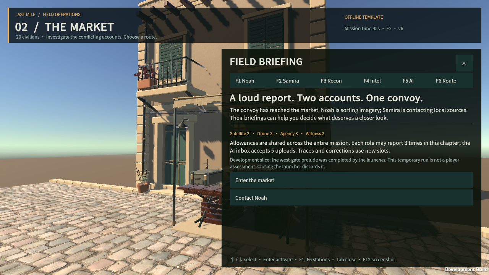
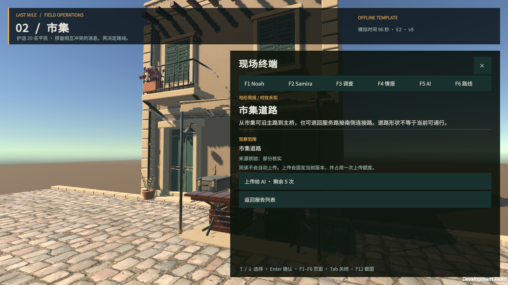

# 原生市集可玩片段 v1

日期：2026-09-27。基于已经验收的 URP 市集美术样板，接入现有游戏后端的公开协议。目标是验证“在精细场景内调查与决策”，当前范围为 **E2 市集**。

## 可以试玩的流程

1. 启动本机试玩，阅读市集简报，进入第一人称场景。
2. 在原有电台桌联系 Noah；新设民事联络、侦察和指挥工作台。靠近后按 E，或用 F1–F6 打开终端。
3. 领取岗位简报，或选定调查渠道、查看成本后确认调查。溯源必须选择已有报告。
4. 阅读报告、核对来源与观察范围。阅读本身不上传；玩家逐条决定哪些版本发给 AI。
5. 查看顾问的摘要、理由、条件、论据及引用，回查对应报告；可以询问路线比较、下一步应查什么，或输入自定义问题。
6. 查看路线的已知风险、耗时和不可逆提示，填写理由，选择参考报告和是否依据已显示的 AI 分析，再提交。
7. 后端推进至 E3；原生端显示衔接页，可在浏览器继续同一局。调查余额、报告、AI 历史和已提交决定都来自同一服务。

暂时通过电台联系队员；未将新工作台描述为完整动画人物。四处工作台均为中性布景，不包含隐藏剧情线索。终端菜单也可远程访问，避免把操作距离当成情报权限。

## 运行

在仓库根目录：

```sh
pnpm build:native-art
pnpm play:native
```

默认英文、剧情测试变体 A、离线顾问。启动器只在 `127.0.0.1:3114` 监听，使用内存数据库；西门序章由测试启动器预先执行。退出应用或关闭启动器清空本次临时试玩。浏览器继续时请保留原生窗口和启动器。

```sh
pnpm play:native --locale zh-CN --case B
pnpm play:native --live-ai
```

只有明确使用 `--live-ai` 时，Node 服务才加载本机 `.env` 并启用已配置的 OpenAI/Anthropic 提供商。没有可用的 provider、model ID、key 会报配置错误。密钥、数据库连接和隐藏变体不会出现在 Unity 参数或资源中。真实模型调用会产生提供商费用；本轮自动测试未执行此选项。模型出错后的降级结果在终端明确标为 `OFFLINE TEMPLATE`。

`--no-open` 只启动服务并打印临时 session ID，供已打开的客户端连接。原生端只允许 HTTP 的 `127.0.0.1` 根地址（端口不小于 1024），拒绝外部地址、凭据、路径、查询参数和跳转响应。线上身份、TLS 部署与保存流程需要单独设计，不能直接把此本机身份流程用于公网。

### 操作

- Enter / 点击场景：捕获鼠标；WASD / 方向键移动；鼠标看向；Q / R 键转向。
- E：附近工作台；F1 Noah、F2 Samira、F3 调查、F4 情报、F5 AI、F6 路线。
- Tab 开关终端，Esc 关闭终端 / 释放鼠标；Home 在行走模式复位。
- 终端中 ↑ / ↓ 选择按钮，Enter 激活；输入框可用鼠标选择并输入。
- F12 截图；行走模式也可按 P；文件名含毫秒以避免快速截图覆盖。
- F9 显示 / 隐藏短时帧率观察。应用切后台以低帧率继续网络任务，角色不会继续移动。
- 语言由新局的 `--locale` 决定，不在进行中的会话中混用两套情报文本。

## 组件与数据边界

| 组件 | 职责 | 不包含 |
|---|---|---|
| `ArtWalkthrough` | 行走、相机、碰撞、焦点、截图 | 游戏剧情真值、模型调用 |
| `FieldStationBuilder` | 生成中性工作台、设备与碰撞 | 根据变体变化的外观或情报 |
| `FieldConsole` | 公开投影展示、报告阅读、确认操作、单个在途网络任务 | 本地推算扣费和剧情结果 |
| `FieldApi` | UnityWebRequest、bootstrap cookie、公开 DTO、幂等请求、冲突重同步 | 公网登录、模型密钥、服务端私有数据 |
| `PublicViews` | 消费 v0.5 的公开字段；Json.NET 保留 JSON null 与枚举字符串 | 服务器领域类或隐藏剧本 |
| `preview-native.ts` | 独立临时服务、测试序章、启动原生应用、可选实时模型 | 线上数据库访问、密钥传给客户端 |
| 既有 `GameService` / AI 层 | 版本检查、额度事务、公开投影、AI 输入隔离与输出校验 | 把 3D 位置当作可见情报 |

原生网络使用 UnityWebRequest 的 cookie 引擎接收本机 bootstrap 身份，没有为兼容原生而放宽现有云端来源校验。响应与 cookie 不写入日志，不在 PlayerPrefs 保存身份。

参考：Unity [UnityWebRequest](https://docs.unity.com/en-us/engine/6000.0/script-reference/unityengine/networking/unitywebrequest) 与 [Json.NET 包](https://docs.unity.cn/Packages/com.unity.nuget.newtonsoft-json%403.2/manual/index.html)。Json.NET 的第三方许可随 StreamingAssets 保留。

## 复用的 API

所有地址以 `/api/v1` 为前缀；完整字段与约束仍以现有 OpenAPI / JSON Schema 为准。

| API | 原生用途 | 一致性约束 |
|---|---|---|
| GET `/bootstrap`、`/health` | 本机身份、契约版本、模型配置状态 | 必须支持 contract 0.5 |
| GET `/sessions/{id}` | 公开情报、资源、任务选项、行动、AI 状态 | 同 epoch 不应用较旧 stateVersion |
| POST `…/tasks` | 领取报告、调查、溯源 | expectedStateVersion + sceneId + runEpoch；后端事务扣费 |
| POST `…/uploads` | 单条上传已收到报告 | reportId + expectedRevision；后端保存不可变版本 |
| POST `…/questions` | 比较、追问、自定义问题 | expectedInboxVersion，空 uploadBatch 不暗中上传 |
| POST `…/display-receipts` | 已显示报告 / 顾问摘要的收据 | 视图真正绘制且前台停留 1 秒后发送 |
| POST `…/actions` | 路线选择 | 理由必填；报告和 AI 依据由玩家选择；服务端结算 |

### 网络失败与重试

- 所有原生 HTTP 操作串行，避免轮询与操作互相覆盖。
- 状态读取约每 5 秒一次；失败后约 15 秒再尝试。不会以轮询产生模型请求。
- 写入命令保存完整序列化 payload、runEpoch、路径和 UUID。网络断开或 5xx 自动重试一次，沿用完全相同的请求。
- 两次仍失败时阻止新写操作，提供“重试原请求”。未知结果不能通过生成新 UUID 再发相同意图。
- 409 冲突为已拒绝操作，清除待重试项并刷新状态，要求玩家重新确认。不会把原意图自动套到新状态执行。
- 只在明确打开报告或顾问摘要后发送阅读收据；后台、仅接收投影或翻到其他标签不算阅读。若客户端关闭时仍有未知结果，本版本不提供跨启动恢复，因此只定位为临时开发试玩。

## 验证方法

```sh
pnpm typecheck
pnpm play:native --smoke --smoke-fault
pnpm play:native --smoke --case B --locale zh-CN
```

烟雾测试运行**实际 ARM64 Unity 应用与真实本机 HTTP 服务**，覆盖 bootstrap cookie、报告、阅读收据、无人机扣费、选择性上传、离线顾问、追问、路线推进和跨幕资源延续。刻意制造旧版本请求检查不扣费；故障模式会丢弃已提交命令的两次响应，验证待确认请求和幂等恢复。故障代理仅用于该测试，绑定 `127.0.0.1:3115`；`--smoke` 拒绝实时模型。

`BuildMac` 还会运行代表性墙体/地面 600 步 CharacterController 碰撞检查。实测结果与截图见本文件末尾的验收记录。

## 下一阶段

1. 精做并接入 Noah / Samira 的人物、待机与电台交流表现；将目前工作台互动提升为人物交流。
2. 制作西门和主桥的原生环境，统一过场、声音与关卡入口；收掉市集到浏览器的临时衔接。
3. 设计持久化存档、跨启动恢复、原生云端身份与版本兼容，再交付独立安装试玩。
4. 在 1080p 固定路线验收 M4 和 M4 Pro 的持续帧率、内存、热稳定性；当前未作商业版性能承诺。

本轮没有制作正式发行安装包，没有替换 Render 线上版本，也没有把临时测试路径产生的记录作为玩家信任能力评价。

## 本轮验收记录

| 检查 | 实测结果 |
|---|---|
| Unity 6000.3.22f1 / URP | C# 编译、18 个材质映射、ARM64 Mono 开发构建通过 |
| 应用体积 | BuildReport 236,921,573 bytes，约 226 MiB |
| 碰撞 | 600 步真实控制器检查通过，停止于 `(-6.15, 0.19, -7.59)` |
| 原生 HTTP 流程 | 英文 A / 中文 B 的领取、调查、上传、顾问、追问、E2→E3 通过 |
| 重试 | 对已提交任务连续返回两次 503，随后恢复同一 UUID；`LAST_MILE_NATIVE_PENDING_RECOVERED`，上报额度仅扣一次 |
| 冲突 | 人为旧 stateVersion 被拒绝，刷新后才允许重新确认；失败请求不扣额度 |
| 可见性 | 在视窗外、仅显示不足 55% 的内容不触发阅读收据；前台持续可见 1 秒才发送，失焦重新计时 |
| 实际窗口 | 英文入口、英文报告与上传、中文调查列表/确认/报告、F1–F6 与 ↑/↓/Enter 实际操作通过 |
| TypeScript | `pnpm typecheck` 通过 |
| 后端及现有玩法回归 | instant-actions、provenance、protocol、integration、delivery、campaign-fields：6 文件 / 65 项通过 |
| 实时模型 | 接入既有 provider，提供显式启动选项；本轮未调用收费模型，不宣称已验收模型生成质量 |
| 鼠标与性能 | 自动化坐标点击未稳定触发原生控件，仍需真人复核鼠标点击/看向；未新增持续 1080p 性能结论 |

验收日志在忽略提交的 `unity/LastMileArt/Logs/native-build.log` 与应用 `Player.log`。故障测试只在本机临时服务运行，未修改线上鉴权。原生应用目前仍使用旧的 `Market Art Study` 产品/包名称以保持本机路径连续；游戏主界面显示 FIELD OPERATIONS。

以下为实际原生应用截图：




