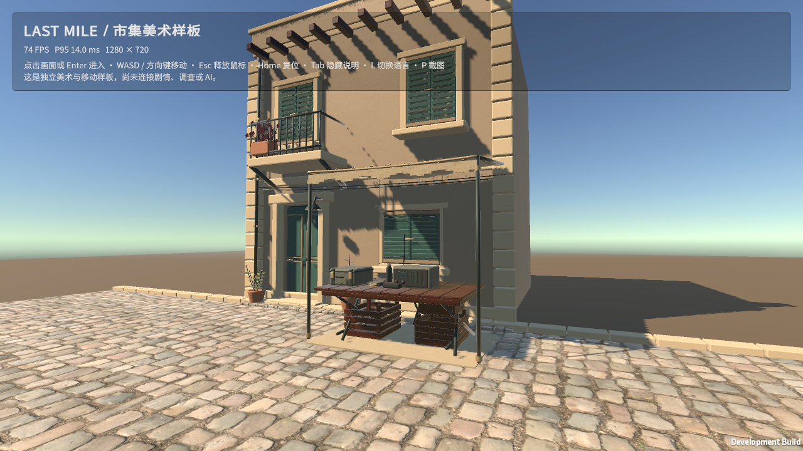

# 原生 URP 市集样板：环境与接入记录

更新：2026-09-27。分支：`feature/market-first-person-slice`。

## 本轮范围与状态

当前已交付**可运行的 macOS Apple Silicon 市集美术与行走样板**，使用 Unity 6.3 LTS / URP 17.3。它是原生移植的第一步；完整剧情、AI、角色动画和商业美术验收尚未完成。

| 项目 | 实际状态 |
| --- | --- |
| Unity Hub | 3.21.3 ARM64，已安装；官方签名检查通过 |
| Unity Editor | 6000.3.22f1 Apple Silicon，已安装并注册到 Hub |
| 安装包 | 官方发布包；Unity Technologies SF 签名及 MD5 `adebcef69687bf1864227ec1cd66fa04` 核对通过 |
| Editor 完整性 | `codesign --verify --deep --strict` 通过，已执行真实编译与构建 |
| 账号许可 | Hub 显示 Personal 许可；用户已确认处理条款，批处理构建可用 |
| 额外模块 | 未安装 Web、Android、iOS、IL2CPP 等模块 |
| 磁盘占用 | Editor 约 9.1 GiB，项目 Library 约 1.8 GiB，应用约 223 MiB；验证期间约 6–8 GiB 可用，动态变化 |
| 资产准备脚本 | 已执行成功：18 个材质记录、11 张贴图、FBX，约 15 MiB 暂存目录 |
| Node 脚本与差异检查 | 语法检查、资产准备、`git diff --check` 通过 |
| C#、URP、macOS 构建 | 通过，无 C# 编译错误；18 个材质映射通过，建筑高度 7.84 m |
| 原生架构 | 主程序与 UnityPlayer.dylib 均由 `file` 确认为 arm64 |
| 构建体积 | Unity BuildReport：233,759,246 bytes；实际目录约 223 MiB |
| 实机画面 | M4 / macOS 26.2，1280 × 720，英文默认与中文提示均通过；见下方截图 |
| 操作 | Enter 捕获、W/S 移动、Home 复位、Esc 释放、L 双语、P 截图已操作验证 |
| 碰撞 | 真实 CharacterController 连续 600 步检查通过，停在 `(-6.15, 0.19, -7.59)`，未穿墙或丢失地面支撑 |
| 性能 | 仅作短时观察，尚无 1080p 持续 10 分钟路线测试或 M4 Pro 测试，不宣称目标帧率已验收 |

安装器一度同时留下旧版入门引导安装残留和新安装压缩数据，导致磁盘不足。只清理了本轮 Unity 安装包及已确认版本的临时压缩数据，并用已校验的 6.3 数据补全 Editor，再验证代码签名。未删除个人文件或项目历史资产。

> 后续增量：美术样板已接入 E2 本机玩法，见 [原生市集可玩片段 v1](native-gameplay-v1.md)。下文保留首次美术验收记录；当前控制与启动方式以工程 README 为准。

## 工程与数据流

独立工程：`unity/LastMileArt`。原有 `unity/LastMile` 战略沙盘工程及 Web 构建流程保持独立。

1. `scripts/prepare-native-art.mjs` 从既有 FBX、贴图和 GLB 材质参数准备中性美术资产；相同文件不重复写入。
2. `NativeArtImporter` 配置米制比例、法线、贴图色彩空间和纹理尺寸。
3. `NativeArtBuilder` 将材质映射至 URP Lit，转换 roughness → smoothness alpha，建立灯光、碰撞、相机、ACES 调色和场景。
4. `ArtWalkthrough` 提供第一人称行走、鼠标释放/复位、中英文提示、滚动帧时间及截图。
5. `scripts/build-native-art.mjs` 封装准备、打开与 macOS ARM64 Mono 开发构建，启动前检查最少 3 GiB 工作空间。

原始复制资产不重复提交；已保留 `.meta`、场景、项目设置、包锁文件与生成材质，以保持跨机器引用稳定。角色、对话、剧情、调查、联网身份、存档和 AI 在该样板中尚未连接。美术不读取后端隐藏剧本或 `.env`。

## 本轮修复

- 首次实机暴露了系统字体在 Unity TextCore 中无法载入的问题。改用随应用附带的 Noto Sans CJK SC Regular；上游固定版本、SHA-256 和 SIL OFL 许可随源码/应用保留。
- 通过 `OSXStandalone.UserBuildSettings.architecture` 明确指定 ARM64，避免只改旧 PlayerSettings 接口却仍产出双架构包。
- 增加 Enter 键进入/退出鼠标捕获，提供不依赖点击的操作入口。
- 切换应用焦点时重置帧时间样本，避免暂停帧污染平均 FPS；保留前台真实长帧。
- 增加 Editor 菜单 **Last Mile Art → Check Floor and Wall Collision**，使用真实场景与 CharacterController 检查代表性街面/墙体碰撞，不保存测试位置。

## 原生截图

以下来自实际 macOS 应用，非概念图或 Blender 离线渲染。




## 复现与下一步

```sh
pnpm prepare:native-art
pnpm build:native-art
```

启动 `unity/LastMileArt/Builds/LastMileArt.app` 即可试玩。构建输出和 Library 不提交 Git；源码与可复现的场景设置提交开发分支。准备、构建和碰撞日志在本机 `unity/LastMileArt/Logs`。

自动化操作工具对该原生窗口的坐标点击/拖动返回 `noWindowsAvailable`，因此鼠标视角拖动与点击入口尚未完成自动化验收；键盘入口、行走与鼠标释放已验证。碰撞测试覆盖代表性墙体和街面，尚未覆盖所有道具边角。

此后再精做人物、环境细节、间接照明，按固定路线测量 M4 与 M4 Pro。1080p 下的 30/60 FPS 是目标，当前没有持续测试结果。没有以概念图承诺实际运行效果，也没有把这一静态样板当作所有关卡的原生移植。

操作细节见 [工程 README](../../../unity/LastMileArt/README.md)。
