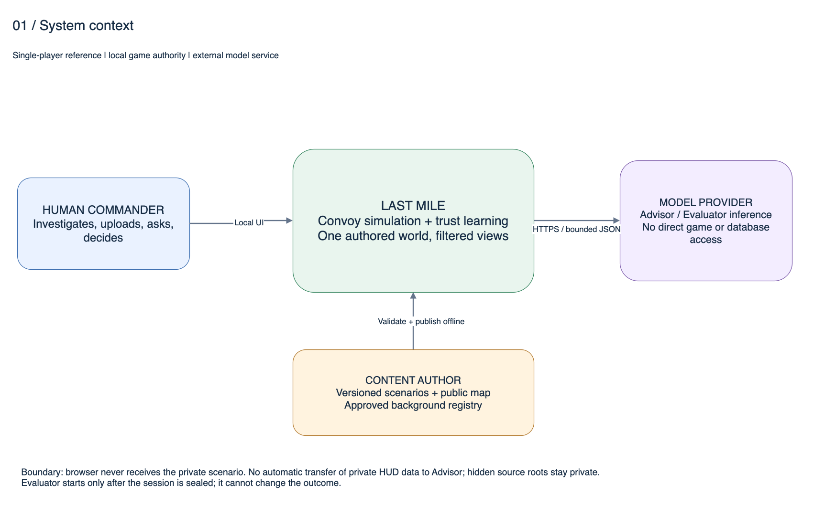
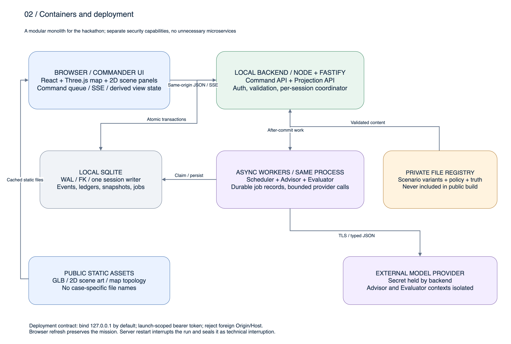
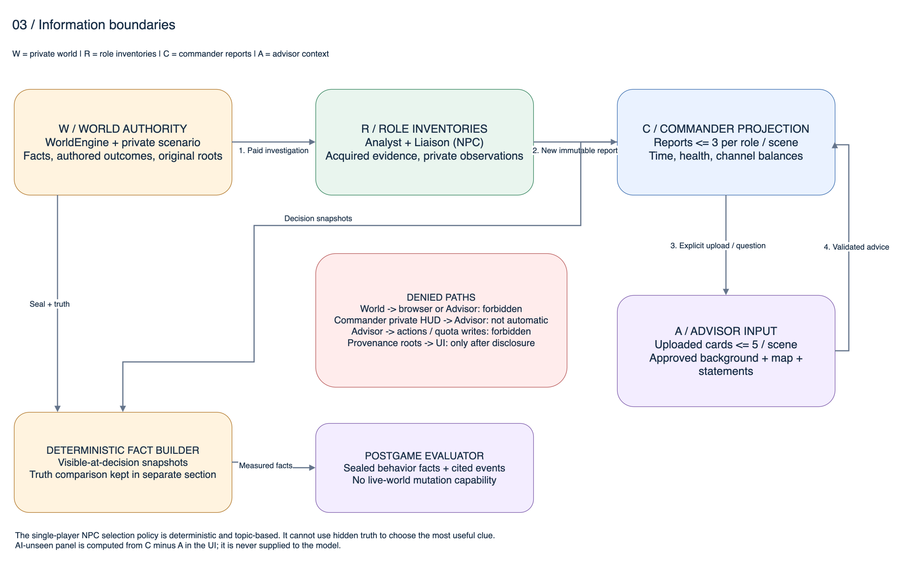
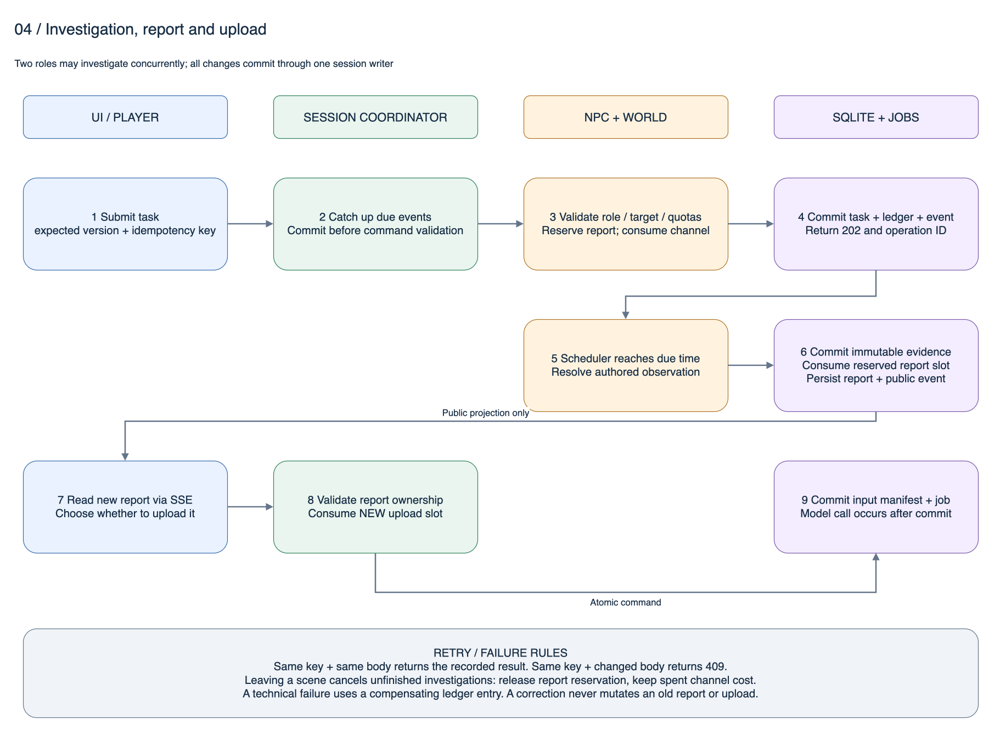
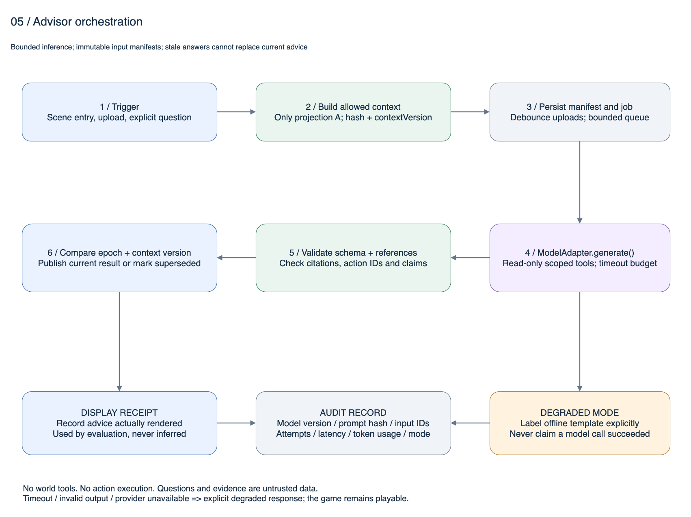
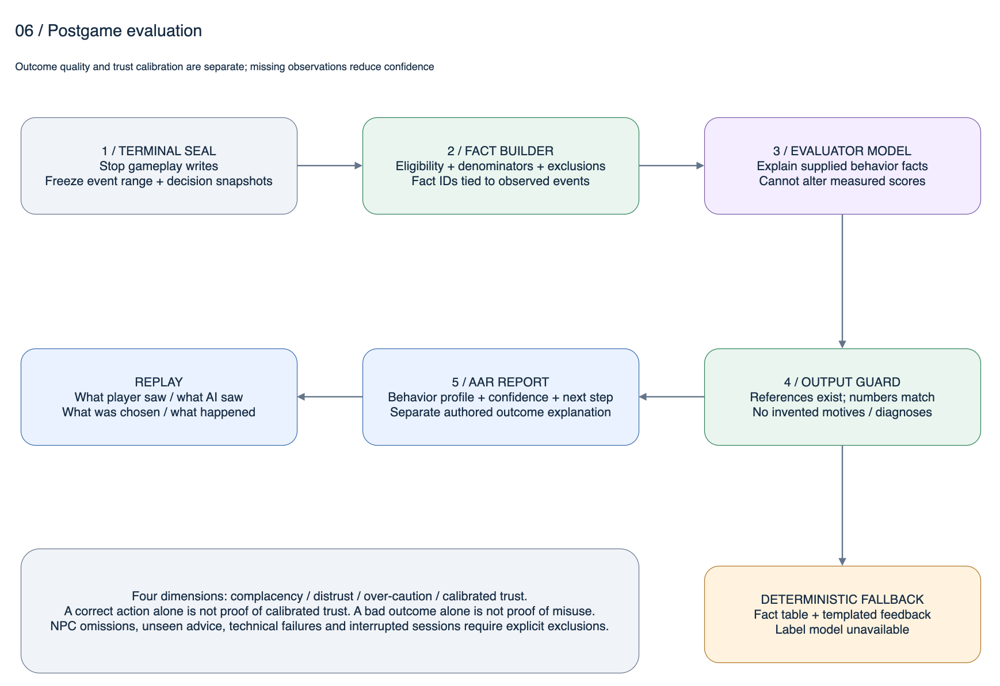
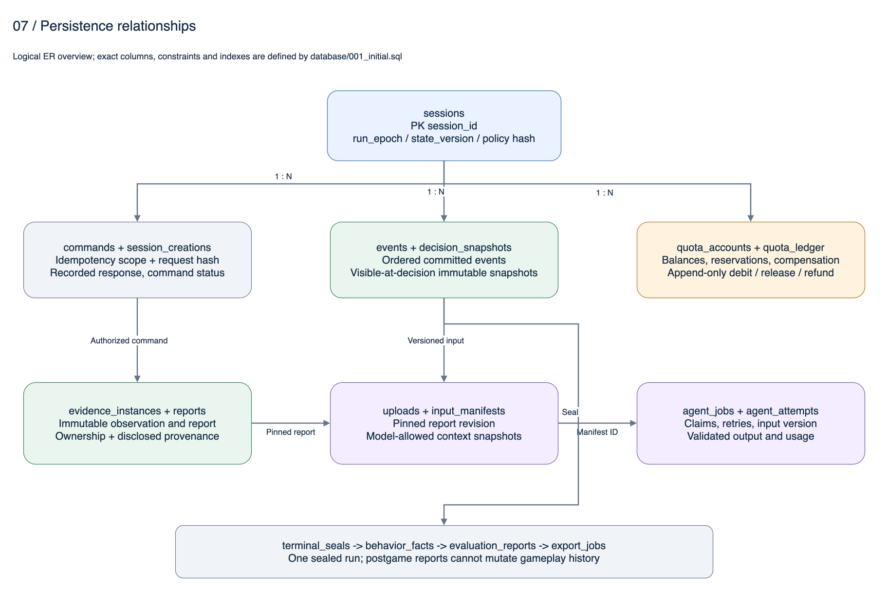
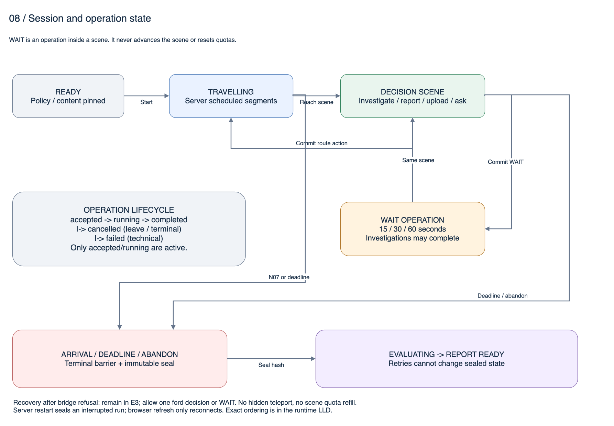

# LAST MILE 高层设计（HLD）v0.5

**评审目标：**说明系统边界、模块职责、数据流、故障策略及关键取舍；接口字段与SQL以相应LLD为准。  
**基线：**单人参考配置；全部待签定产品差异见 [ADR-001](adrs/001_产品基线与差异.md)。

## 1. 设计摘要

采用本地网页客户端＋单个模块化后端＋SQLite。世界引擎拥有游戏状态，所有玩家命令进入同一个会话协调器。异步调查由持久任务记录与调度器完成；AI调用在数据库事务之外执行。客户端接收专门的公开视图，永远不下载完整剧情。

逻辑上分成三个世界：预写真实世界、受限信息中的玩家与Advisor、终局后独立评价。它们不是三份能互相任意读取的数据库连接。通过模块依赖限制、明确投影函数、封闭Schema和负向测试共同执行隔离。

这是适用于小团队hackathon的工程方案。没有Kafka、分布式锁或微服务；可靠性来自单一写入顺序、幂等命令、数据库约束、版本化输入和可重放日志。增加并发用户时才需要重新评估部署，而不是先把复杂度移到基础设施。

## 2. 图纸导航与读法

所有图均用原生可编辑draw.io XML保存，并由draw.io桌面版实际导出PNG。不是把截图嵌入draw.io冒充可编辑图。图中的短标签用英文，概念解释用中文；每张图只解决一层问题。

[完整八页源文件](diagrams/LAST_MILE_Architecture.drawio)

| 图 | 回答的问题 | 源文件 |
|---|---|---|
| 01系统上下文 | 谁使用系统、哪些服务在外部 | [Context](diagrams/01_Context.drawio) |
| 02容器/部署 | 哪些进程和存储运行在哪里 | [Containers](diagrams/02_Containers.drawio) |
| 03信息边界 | 谁能知道什么、禁止哪些路径 | [Information](diagrams/03_Information_Boundaries.drawio) |
| 04调查链 | 从点击到扣费、上报、上传何时提交 | [Investigation](diagrams/04_Command_Sequence.drawio) |
| 05参谋调度 | 如何防止超时/旧答案/越权工具 | [Advisor](diagrams/05_Advisor_Sequence.drawio) |
| 06终局评价 | 如何先计算事实再生成解释 | [Evaluation](diagrams/06_Evaluation.drawio) |
| 07数据关系 | 会话、账本、证据、模型输入怎样连接 | [Data](diagrams/07_Data_Model.drawio) |
| 08状态机 | 何时等待、转场、结束及可否恢复 | [State](diagrams/08_State_Machines.drawio) |

### 2.1 系统上下文

唯一人类操作者是指挥官。内容作者在运行前发布脚本；模型服务只执行受限推理。将来多人模式会改变授权、角色库存入口、协同和评价单位，必须单独ADR，不能仅增加两个浏览器页面。

### 2.2 容器与部署

| 容器/部署单元 | 输入输出 | 存储/权限 | 故障隔离 |
|---|---|---|---|
| Web Commander UI | HTTP命令；SSE公开事件 | 无truth，无API key；仅当前公开会话视图 | 渲染故障可2D降级，刷新重新同步 |
| Local Backend | API/任务调度/模型worker | 唯一DB写入；私有注册表访问受模块端口约束 | 模型异常不退出API进程 |
| SQLite | 事务、约束、查询 | WAL，外键启用，启动schema检查 | 写失败不显示成功；留存诊断 |
| Private registry | 固定版本剧情、policy、背景 | 服务端专用路径，禁止静态挂载 | 内容校验失败不创建任务 |
| Public assets | GLB、2D插图、公开地图 | 文件名无case；可缓存 | 缺3D时2D；基础地图缺失阻止start |
| Model provider | 固定提示词、allowed input、工具响应 | 仅后端密钥；无DB/World能力 | 超时/限流/无效输出→标注模板 |

参考运行时使用Node24 LTS，HTTP层Fastify、界面React/TypeScript、地图Three.js。实现M0阶段固定具体库版本与lockfile并做兼容构建；本设计不把未安装的依赖写成已验证。Node24的LTS状态已查官方发布表。[Node.js发布周期](https://nodejs.org/en/about/previous-releases)

## 3. 组件职责和依赖

### 3.1 后端模块表

| 模块 | owns：唯一负责的内容 | 允许调用 | 禁止 |
|---|---|---|---|
| CommandAPI | 鉴权、JSON校验、错误映射 | SessionCoordinator | 直接SQL扣费、拼接prompt |
| SessionCoordinator | 单会话序列化、幂等、版本、事务边界 | Store、World、Broker、Reporting、Upload、Scheduler | 事务内调用外部模型 |
| WorldEngine | 纯函数计算动作计划与后果 | 私有已验证内容、状态快照 | 接受模型任意世界描述、网络访问 |
| Scheduler | 按dueMs结算调查/路径/截止事件 | Coordinator系统命令入口 | 绕过终局barrier写状态 |
| InvestigationBroker | 角色/目标/渠道校验、并发和成本 | NpcRoleController、Ledger、World观察端口 | 向玩家泄漏角色未报库存 |
| NpcRoleController | 根据请求主题选卡/交付 | 本岗位Inventory、公开优先级 | 用truth估计哪条最能赢 |
| ReportingService | 创建不可变报告/释放预留 | Inventory、Ledger、EventStore | 修改旧报告正文 |
| UploadService | 检查Commander拥有报告、冻结输入 | Reports、Ledger、ManifestStore | 接收客户端自造证据正文 |
| ProjectionService | World/R/C/A/E各视图的显式构建 | 只读Store、公开注册表 | 对DB行做对象展开后“删几个字段” |
| AdvisorOrchestrator | 允许上下文、任务去重/取消、调用验证 | ModelAdapter、A-view、ApprovedBackground | World、私有库存、动作写入口 |
| FactBuilder | 决策事实、分母、排除项 | sealed events/snapshots | 从生成文本猜心理动机 |
| EvaluatorOrchestrator | 对事实做可读解释 | ModelAdapter、sealed FactBundle | 更改分数、改结果、调用Advisor历史全量原始上下文 |
| OutcomeRenderer | 作者结果解释 | sealed truth＋执行记录 | 将真相优势倒填到行为评分 |
| ModelAdapter | 供应商协议、用量、流式/JSON边界 | provider SDK/HTTP | 引入业务决策或自动重试写命令 |
| SQLiteStore | 事务、prepared statements、索引 | DB | 作为“万能Repository”暴露给所有模块 |

模块依赖通过TypeScript导出端口和测试执行；所谓隔离不是只写一句prompt。对Advisor做依赖扫描与越权工具测试。数据库本身不提供每模块数据库用户，应用必须禁止跨边界import。

### 3.2 前端组件

`AppShell → SessionGate → CommanderScreen → {Hud, MapViewport, ScenePanel, TaskDrawer, ReportsPanel, AdvisorPanel, ProvenanceDialog, ActionBar}`；终局进入`OutcomeScreen → AARPanel → ReplayDrawer`。

只有SessionStore保存服务端确认的权威投影；UI局部Store保存筛选/草稿/弹窗，不保存第二份游戏规则。地图负责呈现，不能自行判定已到达下一关。API客户端从OpenAPI生成，Schema构建检查防止手工DTO漂移。

## 4. 信息与能力边界

### 4.1 数据投影规则

| 投影 | 允许字段来源 | 版本变化原因 |
|---|---|---|
| CommanderView | public map、当前可见状态、report、余额、HUD、已验证advice | 有意义状态提交；不逐帧更新DB |
| AdvisorInput | public map/position、已上传的本关卡片、approved background、玩家陈述 | 显式上传/问题/场景进入/公开合法动作集合变化；不因私人时钟变动重算 |
| ProvenanceView | 已向Commander披露的核验边及可见报告 | 新的核验上报；不是按rootId自动聚类 |
| EvaluatorInput | terminal seal、FactBuilder输出、准许的事件引用 | 只针对sealedHash生成，一次版本一份 |
| ReplayView | 当时玩家可见快照、AI实际展示记录、选择与结果 | 终局后只读；author truth另区，不能伪装当时信息 |

封闭Schema、内容标记扫描不能证明语义上完全不会泄漏，因而还要用“更改隐藏case但保持A相同”的对照测试。AdvisorInput字节应相同；模型自身随机性不用于判断投影是否泄漏。

### 4.2 模型看不到≠不知道任何东西

基础模型仍含一般知识；本系统保证不主动给它本局隐藏脚本。地图、经允许的背景或玩家自由输入可能带来推断。不能在宣传中声称模型被数学保证只知道5条事实。

自由文本中的“还有30秒”是玩家主动信息传递，按未核验陈述进入A；不把它偷偷提升为服务器真值。若产品最终要求严格5事实边界，就应禁止新事实自由输入并改变对应Schema和UI。

## 5. 关键数据流

### 5.1 调查、上报、上传

- 调查接受事务同时写command、task、investigation、channel debit、report reservation、event和响应缓存。
- 到期完成事务创建EvidenceInstance、归属、Report和事件，将预留变成消耗，不二次扣报告额度。
- 玩家上传报告ID和固定revision，服务器复制内容到新的输入manifest；客户端不能上传伪造的“官方无人机报告”。
- 付费溯源产生新EvidenceInstance和Report，再上传时消耗新的上传额度。旧版本保持原样。
- 一次批量上传原子成功或整体失败，去重项不二次收费。没有“前两条成功第三条失败”难以解释的隐式部分结果。

### 5.2 Advisor

每个模型任务固定manifest hash、prompt version、model config hash和assistantContextVersion。任务完成时再次检查runEpoch、场景、context version和终局状态。迟到结果存档为superseded，可在复盘说明，但不覆盖当前面板。

输出先做JSON Schema验证，再检查引用ID、行动ID、数值范围、背景引用权限与禁用字段。仅有“格式合法”不足以证明建议真实可靠；模型质量还需真实推理评测。详细预算、重试条件、工具和降级见Agent LLD。

### 5.3 封存与评价

终局事务阻断游戏写入、取消未完调查/操作，固定event range和hash。评价以sealedHash幂等创建，不使用过期的expectedStateVersion。FactBuilder把“当时显示了什么”和“玩家怎么操作”变成可核验事实；Evaluator只能解释事实，不能重写程序计算的结果。

行为评分没有隐藏真相后见之明。作者真相只用在独立结果说明区：“实际主路封闭，因此发生返程”；不能据此称“玩家明知封闭仍听AI”。后一句只有在对应信息实际展示、引用成立时才可评价。

## 6. 持久化和一致性

数据字典、物理表、索引、触发器、migration和具名事务见 [数据库LLD](03_LLD_数据库.md)。事件日志是审计事实，不采用每次读都从零重放的纯event-sourcing。session表保存当前投影和版本，immutable事件/快照用于恢复检查与回放。

### 6.1 不变量

1. session的内容/规则/case创建后固定；新规则只影响新会话。
2. 一个ID必须在同session中被引用；UUID不可猜不能替代授权。
3. channel/report/upload的可用额均不能为负；reservation和charge分别记录。
4. 已接受证据、报告、上传、manifest和seal不能被原地改写。
5. command幂等键＋规范化请求hash唯一；成功重试返回原响应。
6. 终局后没有gameplay事件；允许模型评价/导出等postgame记录，但不能改既有event range。
7. 模型调用永远在事务外，允许任务执行多次，**发布与业务扣费只允许一次**。
8. 展示回执不等于用户认同；未有回执的建议不能计入“玩家已看到”。

### 6.2 事务排序

每个session持一个异步互斥队列；SQLite事务再提供持久原子性。每次新命令先查已成功的幂等响应，再结算真实已到期事件，独立提交；之后校验版本并执行业务事务。这样一个过期命令失败不会撤销已经经过的时间。

SQLite同一时间只有一个写事务；使用短事务和prepared statements，不在其中运行LLM或长时间文件导出。[SQLite事务说明](https://www.sqlite.org/lang_transaction.html)

## 7. 时间、状态与恢复

进程内时钟使用单调时间，missionTime=anchorMissionMs+(monotonicNow−anchorMonotonic)。系统事件按dueMs、类型优先级、稳定ID排序；到达与截止同刻时先处理到达，意味着“截止时刻抵达”成功。调查到期同刻允许交付，但终局之后不再接受新的上传/行动。

普通浏览器刷新不断局，重新获取snapshot和SSE；服务器进程崩溃/重启则将活跃任务技术封存，不伪造玩家离线期间的决定。首版明确不做跨重启继续同一局，避免壁钟改动和进程外时间漂移造成不公平。可创建新局，评价排除被中断数据。

调度器扫描持久dueMs记录；即使计时回调延迟，也按计划到期时刻结算，不能按唤醒时刻重复加时。具体算法在运行LLD。

## 8. 可靠性、故障与可观测性

| 故障 | 系统反应 | 用户体验 | 运维证据 |
|---|---|---|---|
| API响应丢失 | 相同idempotency重发返回缓存 | 不重复扣费 | request/command关联 |
| 版本冲突 | 409＋新版本，前端重新取快照 | 显示状态已更新，用户重新判断 | conflict计数 |
| SSE断线 | Last-Event-ID重连；缺口要求snapshot | “正在同步”，短时禁用变更按钮 | cursor-gap/lag |
| Model超时/429/结构错误 | 有界重试或标模板 | 继续行动，模式显式 | attempt reason/latency/tokens |
| DB_BUSY | 短重试，总预算≤500ms；否则503 | 同key安全重试 | busy时长 |
| 空间不足/IO异常 | 回滚，不返回成功；健康降级 | 提示本局无法保存，允许安全结束 | storage_error、临时诊断 |
| GLB加载/显卡失败 | public-map 2D模式 | 玩法完整但画面简化 | asset_load_ms/fallback |
| 服务端重启 | 活跃局technical interruption seal | 保留可复盘记录，启动新局 | boot_id/recovery_event |
| 导出失败 | export job失败，可重试 | 原游戏/评价不受影响 | export error无私密payload |

日志统一包括requestId、sessionId（本地可查）、commandId/jobId、stateVersion、elapsedMs、resultCode。默认不记录玩家自由文本、完整prompt、模型原始响应或密钥。需要调试原文时由本地显式debug配置开启并标清保存位置；导出仍只使用白名单。

指标：命令延迟分位数、409/422次数、余额约束失败、SSE滞后、任务排队/取消、模型模式与失败原因、每局实际用量、引用守卫拒绝、降级比例、terminal与AAR耗时。不得把模型fallback和live_model合并计算“AI成功率”。

## 9. 安全、隐私与打包

- 默认只监听127.0.0.1；启动生成随机launch token，浏览器端只存当前启动会话内存/sessionStorage。外网部署不是同一安全方案。
- 校验Host/Origin，禁用宽泛CORS；所有session资源按launch绑定校验。Native EventSource不能设置Authorization时使用fetch流式SSE；不把bearer token放URL日志。
- 私有scenario、DB、模型key不进入public目录/前端bundle。公开素材使用内容hash，不使用A/Bcase作为可枚举路由答案。
- 读取模型工具只接受manifest内已有ID；不接受任意URL、SQL、文件路径、shell。提示词注入只作为不可信文本处理。
- 模型调用上传哪些内容在首次使用说明中清楚呈现；默认仅存本地会话，无遥测上传。
- 会话导出为结构化回放包，按用户动作生成。模型key、原始provider错误堆栈、私有未来关卡不导出；终局真相说明只包含本次发生的作者解释。
- 保留策略：开发机默认本地保存最近30天/最多100局，启动时仅提示清理建议，不自动删除本次设计资产；正式清理作业在实现时带导出提示并遵守用户设置。

## 10. 版本、部署与演进

目录建议：`apps/web`、`apps/server`、`packages/contracts`、`packages/domain`、`packages/agents`、`content/private`、`assets/public`。Schema作为唯一边界定义，生成TS客户端；生成文件不能手改。

发布产物固定版本manifest：build、DBschema、content、policy、prompt、modelConfig、publicAssets。启动比对兼容性；未知DB版本fail closed。migration先备份并校验，再事务迁移；回滚通过恢复备份，不破坏旧数据。测试数据库与玩家会话数据库隔离。

后续多人扩展影响ADR-001、actor auth、R-view公开接口、角色命令、SSE分流和评价归因；不复用本地launch token当多人安全模型。多实例扩展才考虑PostgreSQL与持久任务队列，保持OpenAPI、领域规则和模型输入契约可迁移。

## 11. 设计参考与适用范围

参考C4的分层图、Google公开代码评审关注项和Microsoft公开API指导，目的是让边界、取舍和验证证据可审查；它们不是统一的“FAANG PRD模板”。[C4图层](https://c4model.com/diagrams)、[Google评审要点](https://google.github.io/eng-practices/review/reviewer/looking-for.html)、[Microsoft API指导](https://github.com/microsoft/api-guidelines/blob/vNext/azure/Guidelines.md)

接口锁定OpenAPI3.1.1与JSON Schema2020-12，兼容工具生态，不宣称3.1.1是最新规范。[OpenAPI 3.1.1](https://spec.openapis.org/oas/v3.1.1.html)
