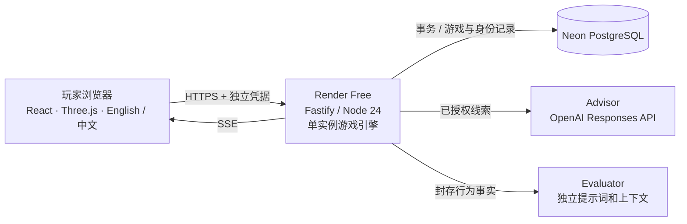

# LAST MILE：部署方案与技术栈

更新：2026-09-16。当前部署目标：**Render Free Web Service + Neon Free PostgreSQL + OpenAI 真实模型**。团队和评委通过定向分享链接，各自进行单人游戏，目标并发 1–5 人。旧版付费 Render/持久磁盘建议已被“基础托管必须免费”的决定替代。

具体填写步骤、环境变量、免费平台限制与待完成的线上验收，请看 [云端试玩部署](云端试玩部署.md)。源码中的 `render.yaml` 与 `deploy/render.env.example` 是部署配置；模板不含真实凭据。

## 1. 系统组成

所有玩家通过服务器调用模型，不接触服务端 API key。顾问和评价者可以共用供应商账户，但使用独立输入边界。隐藏剧本不发给顾问；评价者只接收经过筛选的行为事实，不把结局优劣直接当作信任判断正确与否。

## 2. 技术栈清单

| 层 | 当前技术 | 用途 |
|---|---|---|
| 语言 | TypeScript | 浏览器、后端、测试与契约类型 |
| 运行环境 | Node.js 24 | HTTP、游戏规则、调度、模型调用 |
| 包管理 | pnpm 11，锁文件 | 可重复安装；启动脚本用 `tsx` |
| 构建 | TypeScript 编译检查、Vite | 校验代码并构建客户端静态资产 |
| 页面 | React 19、CSS、Lucide 图标 | 任务界面、情报卡、决策、复盘、邀请入口 |
| 地图 | Three.js、GLB/glTF、Blender 作者资产 | 浏览器中的沙盘与关卡场景 |
| 美术 | 2D 场景插画、UI 图形、3D 沙盘 | 混合视角呈现；无需玩家安装 Blender |
| 双语 | 项目自有 locale/context 与字典 | 英文默认、中文可选、每局固定语言 |
| HTTP | Fastify 5、`@fastify/static` | 同域 API 与构建产物交付 |
| 契约 | OpenAPI、JSON Schema、Ajv | 请求/响应/AI 输出校验 |
| 实时更新 | Server-Sent Events (SSE) | 有序事件、重连、服务端状态同步 |
| 游戏引擎 | 项目自有规则引擎 | 3 关、2 套剧本、有限调查资源、行动分支 |
| 本机数据 | Node `node:sqlite` | 默认本机运行、独立测试、原有存档 |
| 云端数据 | PostgreSQL、`pg` 驱动 | 独立玩家身份、存档、事件、幂等、调用额度 |
| 数据一致性 | SQL 事务、约束、触发器、单引擎锁 | 原子扣额度、不可变证据、结局封存 |
| AI | OpenAI Responses / Anthropic 适配器，原生 `fetch` | 顾问与终局评价；结构化输出与引用边界 |
| 本轮模型配置 | OpenAI `gpt-5.6-luna`、reasoning `low` | 本机已做有限真实调用验证；上线后另做完整试玩 |
| 试玩身份 | 邀请口令、独立随机 cookie、服务端凭据摘要 | 不同玩家存档隔离；不要求每人提供 API key |
| 成本控制 | 全站发送次数、模型并发、每人新局与活动局限制 | 限制试玩规模，失败/修复发送也计数 |
| 单元/集成测试 | Vitest | 规则、AI 边界、HTTP、SQL、云端归属 |
| 浏览器测试 | Playwright | 完整交互、关卡、双语与布局 |
| 托管 | Render Free + Neon Free | 免费基础托管目标；实际费用取决于所选套餐与限额 |
| 源码协作 | Git / GitHub / GitHub Actions | 仓库、版本、构建测试 |

## 3. 两种运行模式

| 项目 | 本机 | 云端试玩 |
|---|---|---|
| `LAST_MILE_MODE` | `local`，默认 | `cloud`，显式设置 |
| 监听 | `127.0.0.1` | `0.0.0.0:$PORT` |
| 数据库 | `.last-mile/game.sqlite` | `DATABASE_URL` 指向 Neon |
| 模型 | 可选 offline/openai/anthropic | 必须配置 openai/anthropic 与 key/model |
| 身份 | 本机启动凭据 | 独立访客凭据＋游戏归属 |
| 分享 | 自己电脑使用 | 分享 HTTPS 地址与邀请口令 |

`offline` 是确定性的规则模板，不调用模型；它用于无 API 费用开发和测试。真正上线时用 `openai`，不是将 offline 环境变量原样发布。

## 4. 采用单实例的原因与限制

引擎在进程内维护游戏时钟和任务调度，数据库保存已经提交的状态。PostgreSQL 的会话锁阻止两个引擎同时推进同一数据库。此轮不启用多副本、分布式调度或自动扩容；5 人分别试玩由一个服务承载。

平台中断后，正在进行的局被诚实标为技术中断；已保存历史仍归原玩家。免费实例可能休眠或回收，因此本方案不是高可用商业发布。数据库和身份持久化、前端可恢复历史，解决的是记录丢失与归属问题。

目前无需 Redis、Kubernetes、LangChain、向量数据库、多人房间、WebSocket 服务器或 Docker 镜像。若未来大规模开放，需要重新设计用户账号、全局任务队列、备份恢复和运维容量。

## 5. 验证范围

原本机版本通过 192 项单元/集成测试与构建；真实模型接入有独立的有限验证记录。这些历史结果不代表云端版已经验收。

本轮新增 PostgreSQL 迁移、异步事务、访客隔离和云端限额，须经过新的回归及部署验收。**实际 Neon 连接、Render 发布、真实 HTTPS 下的完整三关模型试玩仍需单独完成。** 当前发布状态以 [云端试玩部署](云端试玩部署.md#8-发布记录) 为准。
