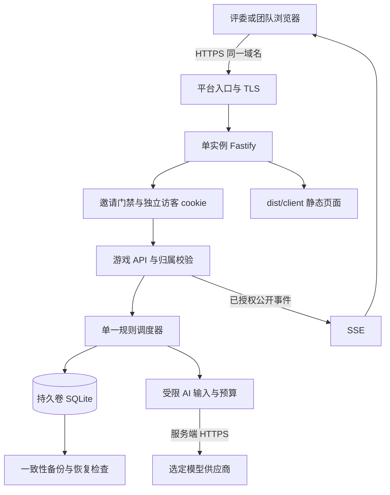

# LAST MILE：部署方案与技术栈

核对日期：2026-09-16。适用范围：团队与评委通过定向分享链接试玩；每名玩家独立进行一局单人游戏。

本文是部署咨询与后续实施方案。未创建云账号、购买资源、发布服务、制作 Docker 镜像或验证云端运行。标为“现有”的内容依据当前代码；标为“建议／待实现”的内容不代表已完成。双语界面的完成范围以本轮本地化验收为准。

## 1. 推荐方案

**首选 Railway：一个常驻 Web 服务、一个持久卷、SQLite、一个应用进程。** 页面、API 和 SSE 使用同一个 HTTPS 域名。补好试玩入口口令、独立访客身份、游戏归属校验及 AI 总预算后，再向团队和评委分享链接。

**次选 Render：付费 Web Service＋持久磁盘。** 可采用同样的应用结构。暂不需要把游戏拆成多个服务，也不需要为了首轮试玩更换数据库。

“单人游戏”与“多位访客同时各玩一局”并不冲突：需要的是服务器隔离不同玩家的局，而非增加多人协作玩法。**定向分享链接本身没有访问控制能力**，链接被转发后仍可访问；所以入口门禁与访客隔离是两个分别需要解决的问题。

Docker 可以把服务及依赖打成可复现的交付单元，但不会自动解决身份隔离、存档持久化或重启中断。当前仓库没有可直接发布的 Dockerfile／镜像；本轮也没有新增它们。

## 2. 实际技术栈

下表版本是 `package.json` 声明的范围基线，不是对库最新版本的推荐；复现安装应以 `pnpm-lock.yaml` 为准。

| 层 | 当前实现 | 用途与边界 |
| --- | --- | --- |
| 运行时 | Node.js ≥24，ES modules | 服务端使用内置 `node:sqlite`、`fetch`、`crypto`；云环境应固定一个经过测试的 Node 24 补丁版本 |
| 语言 | TypeScript `^7.0.2`，严格类型检查 | 前端、后端、测试共享类型；当前 `tsc --noEmit` 不生成后端 JS |
| 包管理 | pnpm `11.19.0` | 锁文件安装；构建环境明确安装这个版本，不假设基础镜像自带 |
| UI | React / React DOM `^19.3.0`，CSS | 浏览器单页应用；当前本地化采用项目自身的字典与内容映射，并非新增外部翻译服务 |
| 地图与图标 | Three.js `^0.186.0`，Lucide React `^1.46.0` | 浏览器渲染 3D 沙盘，提供 2D 回退；运行服务器不需要 Blender 或 GPU |
| 构建 | Vite `^8.3.0`，React plugin `^6.1.1` | 生产静态文件输出到 `dist/client`；Vite 开发服务器不用于公网生产 |
| HTTP | Fastify `^5.12.4`，`@fastify/static ^10.1.3` | 一个进程提供静态页面、23 个既有 API 操作（含 SSE） |
| 契约校验 | Ajv `^8.20.0`，ajv-formats `^3.0.1` | OpenAPI 3.1.1、JSON Schema 2020-12；请求与响应独立校验 |
| 游戏规则 | 自有 TypeScript 状态机、任务调度、公开投影 | 服务端决定时间、资源、证据解锁、动作后果及终局；隐藏案卷不交给浏览器 |
| 数据库 | SQLite，Node `DatabaseSync` | WAL、外键、`synchronous=FULL`、事务、幂等、持久事件、终局封存；未使用 ORM 或 PostgreSQL 驱动 |
| 实时更新 | 原生 EventSource／SSE | 持久游标续传、15 秒心跳；时钟样本不等同游戏行为记录 |
| AI | 原生 `fetch` 的 OpenAI Responses / Anthropic Messages 适配器 | 结构化输出、引用检查、用途隔离；可选离线模板模式，无供应商 SDK 依赖 |
| 测试 | Vitest `^5.0.1`、Playwright `^1.63.0` | 领域、HTTP、AI mock 与真实浏览器流程；通过本地测试不代表通过云端测试 |
| 格式化／开发运行 | Prettier `^3.9.6`、tsx `^4.23.13` | 当前 `pnpm start` 实际用 tsx 运行 TS 源码 |

Blender 是地图制作工具。网页内的交互地图由 Three.js 绘制；玩家只需浏览器。PostgreSQL、Redis、Kubernetes、CDN 分离部署及账号 SaaS 均不是当前实现的必需组成部分。

代码依据：`package.json`、`vite.config.ts`、`server/index.ts`、`server/http/{app,config,contracts}.ts`、`server/core/{store,implementation,world}.ts`、`server/ai/{index,providers}.ts`。

## 3. 当前为何不能直接装进 Docker 就开放公网

| 现有行为与位置 | 直接部署会发生什么 | 上线前最小改造 |
| --- | --- | --- |
| `config.ts` 固定监听 `127.0.0.1`，域名配置只接受 loopback | 容器外的平台代理无法正常连接；加公网域名会配置失败 | 保留本机模式；新增显式云模式，监听 `0.0.0.0:$PORT`，配置精确公网 Host / Origin |
| `app.ts` 拒绝非 loopback 来源，`trustProxy:false` | 平台代理和健康检查会收到 403 | 明确受信平台代理范围与头部处理；为健康检查配置受控路径／Host，不一概相信客户端伪造的转发头 |
| `/bootstrap` 对通过本机检查的访问者发放同一个 launch cookie | 多个公网浏览器得到相同凭证；服务端只知道它们属于同次启动 | 替换为独立访客会话；入口口令只决定是否准入，不能作为大家共用的游戏身份 |
| `hasSessionAccess()` 按进程的 `launchId`／`granted` 集合判断权限 | 不具备“这个局属于哪个访客”的隔离；知道另一局 UUID 的同凭证访客可能访问它 | 每条游戏及子资源读写、SSE、复盘、评价、导出都校验服务端 owner；UUID 不是授权凭据 |
| cookie 当前无 `Secure`，启动 token 每次随机生成 | 公网 HTTPS 身份策略与跨重启身份恢复不完整 | HTTPS 下使用 Secure、HttpOnly、SameSite 的随机访客 cookie；只在数据库保存 token 哈希，设置有效期与撤销机制 |
| 默认数据库在 `.last-mile/game.sqlite` | 若写进容器临时层，重部署可能丢存档 | 挂载持久目录；设置 `LAST_MILE_DB=/data/game.sqlite`，使数据库、WAL 与 SHM 同处持久卷 |
| `recover()`／`close()` 将未完成局封为 `technical_interruption` | 发布、平台重启或崩溃会结束正在玩的局，不会自动续玩 | 首轮保留这一诚实语义；加入停收新局的维护开关、等在玩局结束后发布、重启后原访客查看自己的中断记录 |
| `--resume-session` 只给本机新 launch 授予终局只读／评价／导出权限 | 公网访客不能自然找回旧启动的历史记录 | 持久访客归属与授权读取，不把所有旧局授予每个新访客；跨设备恢复账号可后续再做 |
| 调度器、局缓存、当前单调时钟和 AI dispatch 状态在进程内 | 同库多个进程不具备可靠的单一执行者；新进程恢复还会封存旧进程的活动局 | 首轮锁定单进程单副本，不启 PM2 cluster／横向复制；数据库换成 PG 也不能直接解除该限制 |
| AI 限额主要约束单局／单 job | 不受控的访客可反复建局消耗总额度 | 加活动门禁、访客建局限制、全站同时活动局上限、模型并发上限和活动总预算 |

容器端口映射也不能绕过这些限制：监听地址、请求来源检查、身份归属是不同层的问题。不能仅把 Host 改成 `*`、信任全部代理头、或把本机 token 变成所有人共享的长期密码。

## 4. 三个平台的选择依据

这是针对“小规模、定向试玩、愿意在维护时暂停服务”的选择；没有宣称某个平台普遍更优。

| 平台 | 本项目可采用的形态 | 重要限制 | 判断 |
| --- | --- | --- | --- |
| Railway | 常驻单服务＋挂载 `/data` 的 Volume；从私有仓库 Dockerfile 构建或使用私有镜像 | 同服务卷不支持 replicas；带卷重部署有短暂停机；支持手动与定时卷备份 | **首选**：保留现有 SQLite，服务与卷配置集中，适合先把邀请试玩跑稳。[Volumes](https://docs.railway.com/volumes/reference)、[Backups](https://docs.railway.com/volumes/backups) |
| Render | 付费 Web Service＋Persistent Disk；Docker 或原生 Node 均可 | 持久磁盘只由单实例访问，不能多实例扩容；带盘部署没有零停机。Free Web Service 不能挂持久盘，且会休眠 | **次选**：同样简单，适合已经熟悉 Render 的团队。[Disks](https://render.com/docs/disks)、[Free service limits](https://render.com/docs/free) |
| Fly.io | 一个常驻 Machine＋一个 Fly Volume，自行部署镜像 | 卷绑定区域和宿主机，不自动跨卷复制；单 Machine／卷是可接受停机的演示方案，不是高可用方案 | **第三选择**：团队已有 Fly 运维经验时可用；首轮无需增加复制设计。[Volumes overview](https://fly.io/docs/volumes/overview/) |

### 长连接与运行方式

Railway 当前官方限制：持续有数据传输的 HTTP 请求最多 15 分钟，无数据传输时最多 5 分钟。现有 SSE 心跳有帮助，但不能消除 15 分钟上限。应保留游标重连，在真实平台验证跨 15 分钟后不会重放动作、重置计时或串局；游戏十分钟之外的简报、停留和复盘同样会延长连接。[Railway networking limits](https://docs.railway.com/networking/public-networking/specs-and-limits)

试玩窗口内建议关闭 Railway Serverless 休眠。该功能按出站流量判断是否休眠，唤醒有冷启动延迟；本项目还将进程停止视为技术中断，不能依赖流量恰好保持实例在线。[Railway Serverless](https://docs.railway.com/deployments/serverless)

Render 官方将 SSE 等长期连接归为 Web Service 用途；仍需实际验证代理心跳、断线和发布行为，本文没有给未经核实的“无限连接时长”承诺。[Render Web Service tutorial](https://render.com/tutorials/web-service-vs-static-site/web-services)

### 费用如何估算

先按“应用计算资源＋磁盘／备份＋出站流量＋模型调用”四项估算，模型费用单独设预算。Railway 订阅包含一定资源额度，不能简单把订阅费和全部用量重复相加；Render 要选择可挂持久盘的付费服务；Fly 按所选资源计费。不把免费额度当作比赛期间的稳定性承诺，也不在未选择规格与试玩量前给出固定月费。[Railway plans](https://docs.railway.com/pricing/plans)、[Render pricing](https://render.com/pricing)、[Fly pricing](https://fly.io/docs/about/pricing/)

## 5. 首轮上线的端到端结构（建议，未实现）

### 5.1 一个简单的邀请流程

1. 分享 URL 与活动口令，口令不放在 URL 查询串里；可以分开发送。无需首轮要求评委注册邮箱。
2. 入口页面向服务器提交口令。服务端校验口令哈希，对失败尝试限速。通过后为该浏览器签发独立随机凭证；所有人输入相同活动口令也必须得到不同身份。
3. SQLite 记录访客身份、有效期、活动配额，以及 `sessionId → visitorId` 归属。游戏原有 commander / NPC 身份保持不变；访客身份与角色绑定分开。
4. 每次请求从可信 cookie 解析访客；不接受 body 中任意填入的 owner。读报告、按 ID 查看任务、SSE、导出下载都执行相同归属检查。未授权资源返回不披露其存在性的受控错误。
5. 刷新可继续本次进程内的活动局；服务重启后读取自己的终局／中断记录。首轮无需提供跨设备账号恢复；清除 cookie 的恢复边界在试玩说明中写清。
6. 活动结束撤销邀请入口与尚未使用的资格。已有个人记录的保留／删除期限在活动前约定，避免永久保留试玩输入。

建议每位访客同时最多一局，设置整场活动总局数和全站活动局上限；具体值根据邀请名单及压测结果配置。并发上限是应用准入策略，不是对 SQLite 容量的凭空保证。入口校验、建局、提问和 SSE 建连分别限速，不依赖 IP 一项判断，因为多位评委可能共享同一网络。

### 5.2 域名、HTTPS、代理和密钥

第一轮可用平台提供的 HTTPS 子域名，不需要先买域名。若后续绑定自己的域名，按平台后台当前给出的 DNS 记录配置并验证证书；页面、API、SSE 保持同源。Railway 提供生成域名和自定义域名证书；Render 也提供托管 TLS。[Railway domains](https://docs.railway.com/networking/domains/working-with-domains)、[Render Web Services](https://render.com/docs/web-services)

云模式需要精确的公网来源配置、可信代理配置和安全 cookie；状态变更请求做 Origin／CSRF 校验。SSE 使用浏览器自动携带的同源 cookie，不把访问 token 放在 URL、localStorage 或截图可见位置。仅替换成本机 CORS 白名单为 `*` 不满足要求。

模型 key、邀请口令哈希等放平台运行时 Secret／环境变量，分测试和正式环境。不得以 `VITE_*` 变量注入前端，不提交 `.env`，不写镜像构建层或构建日志。保持 HTTP 日志对 cookie 和 Authorization 的脱敏；模型状态页只显示是否配置／是否可用，不返回 key 或内部请求内容。私有剧情文件仅存在服务端镜像或服务端存储；静态根目录必须限定为 `dist/client`。

### 5.3 AI 调用与费用边界

现有实现：Advisor 每局最多 30 次实际发送；每个逻辑 job 最多 2 次尝试；Evaluator 按封存／配置绑定重试上限。Advisor 请求超时 8 秒、输出上限 1,200 tokens；Evaluator 超时 20 秒、输出上限 3,000 tokens。实际成功、失败、超时及未知结果均应保留记账。离线模板必须明确标识，不能冒充真实模型。

上线还需增加：全站模型并发限制、按活动／访客的调用预算、全局金额或 token 预算及人工停用开关。达到预算时拒绝新的付费发送并明确回退；不能只显示一个预算数字而继续调用。金额估算按所选模型的当前价目乘实际输入／输出用量；未指定模型前不估造“每局固定价格”。超时后供应商仍可能已经收费，因此供应商账单与本地调用记录需要核对。

试玩现场先用 `MODEL_PROVIDER=offline` 验证基础流程，再选择一个真实模型，做受控的中英文完整局验证。切换语言仍只改变呈现及模型输出语言，不能扩大 AI 能看到的隐藏事实范围。服务器只发送玩家已授权材料；评委自行输入的文字也会进入选定供应商，应在入口简短说明并提示使用游戏内虚构信息。

## 6. Docker 镜像的准备边界

**可以容器化，建议采用一个应用镜像。以下是待实施的镜像要求，并非已有 Dockerfile。**

| 项目 | 后续实现要求 |
| --- | --- |
| 构建阶段 | 固定 Node 24 与 pnpm，`pnpm install --frozen-lockfile` 后执行类型检查、测试和 `pnpm build`；不要只复制现成开发目录 |
| 运行方式 | 当前 `pnpm start` 依赖 tsx，而 tsx 位于 devDependencies。若保留这一启动方式，运行镜像必须明确保留 tsx；不能 `--prod` 裁剪后再期望它存在。后续也可单独编译服务端 JS，但这需要新增并验证后端构建配置 |
| 必需文件 | `dist/client`、服务端源码／产物、所需 Node 依赖、HTTP 契约与操作表、初始化 SQL、私有剧情和规则内容、`server/ai/assets`；后端会从这些路径读文件，不能只打包 `dist/client` |
| 排除文件 | `.env`、本机 SQLite 存档及 WAL、测试浏览器、测试结果、`.git`、Blender 源文件及无关文档；不要将本机开发数据种进生产镜像 |
| 文件权限 | 镜像代码只读，数据目录可写；优先非 root 运行，并在目标卷上验证 UID／目录权限，不能假设本地目录权限等同云卷 |
| 生命周期 | 容器入口应把 SIGTERM 交给 Node；不得用吞掉信号的 shell 包装，明确关闭 SSE、停止新任务、提交终局 |
| 可复现发布 | 私有仓库构建或私有镜像仓库，按 commit／digest 固定版本；隐藏案卷在镜像中可被镜像持有者读取，因此不发布含私有案卷的公开镜像 |

Railway 可自动检测仓库根目录 Dockerfile，Render 支持 Dockerfile 构建或拉取现成镜像；两者都不会替应用完成上述改造。[Railway Dockerfiles](https://docs.railway.com/builds/dockerfiles)、[Render Docker](https://render.com/docs/docker)

## 7. Railway 部署步骤（仅执行计划）

前置：第 3、5 节改造完成，本地与容器测试通过，并由团队确定活动预算、地区及可接受的中断行为。

1. **准备候选版本。** 把代码放入团队控制的私有仓库，锁定 commit；补镜像和云模式测试。本机模式继续默认 loopback，防止一次云部署改造意外开放开发机。
2. **创建一个项目与一个应用服务。** 从该仓库 Dockerfile 构建；选择靠近试玩者的区域，副本数固定 1，关闭 Serverless。不要额外启动第二份调度器。
3. **创建并挂载 Volume。** 挂载 `/data`，数据库路径设 `/data/game.sqlite`；确认 Node 运行用户能写此目录。先用空库验证初始化，不上传现有个人试玩库。
4. **配置运行变量与 Secret。** `PORT` 由平台提供；`LAST_MILE_DB` 使用上述持久路径；`MODEL_PROVIDER=offline` 起步。云模式、公共 Origin、访客认证与活动预算所需变量属于待新增配置，不能把本文描述当作当前已有环境变量名。真实模型阶段再配置对应 key 和 model。
5. **配置健康检查。** 使用 `/api/v1/health`，改造后允许平台健康探测且不签发访客身份、不调用模型。部署就绪需确认数据库与内容成功初始化。Railway 的部署健康检查不等于上线后的持续监控；活动期间另检查可用性与错误日志。[Railway Healthchecks](https://docs.railway.com/deployments/healthchecks)
6. **生成 HTTPS 域名并完成来源配置。** 把最终域名加入云模式精确 Host／Origin 列表；启动门禁。此时先只让团队测试。
7. **通过双浏览器隔离与实际 SSE 验收。** 使用两个无共享 cookie 的浏览器上下文；确认不能通过替换 UUID 读取对方内容。跨 15 分钟观察 SSE 自动重连，不改变游戏时间或重复扣费。
8. **验证备份与恢复。** 生成一致性备份，在隔离数据目录恢复并核对封存记录、归属和导出。不要直接覆盖唯一的线上卷做第一次恢复实验。
9. **真实 AI 小流量验收。** 开启限定预算，完成中英文各一次真实模型局，确认降级标识、调用次数、输入隔离和供应商用量。通过后分享邀请链接。
10. **固定试玩窗口。** 关闭自动跟随每次 push 的发布，启用日志与预算观察。要更新时先维护停收新局，等待活动局结束，再备份、发布、验证；崩溃仍按技术中断处理。

Render 替代步骤：创建付费 Web Service，选择 Docker，挂载 `/var/data`，将 `LAST_MILE_DB` 指向该目录，单实例、健康检查、域名与门禁保持同样原则。持久磁盘在构建／pre-deploy 阶段不可用，SQLite 初始化与迁移须在唯一运行实例拥有磁盘后执行；使用带盘服务时接受部署停机。[Render disks](https://render.com/docs/disks)

## 8. SQLite 备份、恢复与发布

**建议两层保护：平台卷备份＋可恢复的 SQLite 一致性备份。** 平台备份便于恢复整个卷，但不替代一次实际恢复演练。Railway 支持对包含 SQLite 的卷手动／定时备份。[Railway Backups](https://docs.railway.com/volumes/backups)

SQLite 使用 WAL 时，已提交数据可能仍在 `-wal` 中；不能只拷贝正在运行的 `game.sqlite`。采用 SQLite Online Backup API 等一致性方法，再将备份导出到团队控制的另一存储位置；或在维护窗口正确关闭数据库后做完整备份。Node 端备份命令／脚本是待新增项，当前没有自动备份任务。[SQLite Online Backup API](https://sqlite.org/backup.html)、[SQLite WAL](https://sqlite.org/wal.html)

首轮建议：活动前、每次发布前、活动结束后做可恢复备份；持续多日试玩再配置每日备份。备份包含游戏行为、玩家文本及凭证哈希，只给团队运维成员访问，设置保留期。恢复时先关闭唯一写入进程，在隔离目录校验数据库完整性、外键、版本、归属及已封存导出，再决定切换。

保留上一版镜像只是代码回滚；数据库已迁移时能否回滚需单独确认。当前 schema 初始化支持既定版本，并不具备任意跨版本自动迁移能力。不要在多个副本各自启动时同时跑迁移。

## 9. 何时再考虑 PostgreSQL

首轮继续 SQLite。满足以下实际需求时再启动迁移：大量不受控访客、需要多台应用实例、频繁不停机发布、跨区域访问或更强的数据库运维恢复要求。SQLite WAL 依赖同机协调且同一时刻只有一个写者；把文件挂到共享网络盘并让多台服务器读写不是本项目的扩容方案。[SQLite WAL](https://sqlite.org/wal.html)

后续可以选择托管 PostgreSQL。Render 付费 Postgres 提供时间点恢复；Fly 也提供 Managed Postgres。Railway 的 PostgreSQL 文档描述的是平台部署的数据库服务与镜像，应具体核对所选产品的备份、升级和高可用责任，不能仅因“一键创建”就称为与任意全托管产品等同。[Render recovery](https://render.com/docs/postgresql-backups)、[Fly Managed Postgres](https://fly.io/docs/mpg/)、[Railway PostgreSQL](https://docs.railway.com/databases/postgresql)

迁移至少包括四件事，不能只设置 `DATABASE_URL`：

1. 将同步 SQLite 调用改成支持异步事务的仓储接口，迁移 SQLite 特有 DDL、触发器和约束，并重验幂等／终局不可变规则。
2. 使用持久访客身份与游戏所有权；应用多副本共享认证状态。
3. 为每个活动局及 AI job 建立唯一执行者／事务抢占机制，重新设计跨进程时间恢复；杜绝两个 worker 同时扣资源或发模型请求。
4. SSE 从共享持久事件日志补读，必要时增加通知通道；通知不是事实存储，丢通知后仍能靠游标恢复。

这些是未来演进项目，不属于此次定向试玩的必要建设。仅换 PostgreSQL、保留现有多副本进程内调度器，仍不能可靠运行。

## 10. 首轮上线验收与明确未完成项

下列是**待执行的云上线验收**，不是本地测试已经证明的结论：

- 未通过邀请门禁不能建局、访问报告或触发模型；篡改 Origin、Host 或代理头不能跳过认证。
- 两个独立访客互换游戏／报告／任务／job／导出 ID 均不能读取或修改对方资源，SSE 与下载同样隔离。
- 双语完整局保持同一规则和事实范围；模型或离线模板输出语言可辨，不出现靠翻译扩大情报范围。
- 已上传报告以外的隐藏案卷、密钥、数据库与服务端文件无法由静态 URL、开发资源路径或错误响应下载。
- 页面刷新、网络断开和跨平台长连接上限后能恢复公开状态，动作及模型重试不重复扣费。
- 全站与访客限额真实阻断额外请求；预算耗尽后清楚显示降级，不能开新局绕过活动总预算。
- 维护时停止新局；重启让未完成局成为技术中断，原访客仍能读取自己的结果，其他人不能获得其权限。
- 卷存储跨重部署保留，恢复演练通过；容器不存在把本机测试库或 `.env` 打入镜像的问题。
- 用拟邀请人数对应的并发局压测记录 CPU、内存、事务延迟、SSE 稳定性、模型并发与磁盘增长；未测之前不承诺承载人数。

当前已具备单人玩法、后端规则、SQLite 持久化、SSE、模型适配、契约验证和本地浏览器验收基础。下一阶段最小范围是：**邀请门禁与访客隔离 → 显式云运行模式 → 镜像和持久卷 → 预算与维护机制 → 真实平台验收 → 定向分享。** 本轮不执行发布或采购。
